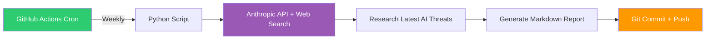

# 🛡️ AI Threat Intelligence Tracker

Automated weekly AI security threat intelligence reports. A GitHub Actions workflow uses the Anthropic API with web search to research the latest AI/LLM security incidents, supply chain attacks, and emerging threats — then commits a structured analysis to this repository.

## How It Works

## Reports

| Date | Report |
|------|--------|
| 2026-04-14 | [Weekly Report](reports/2026-04-14-weekly-report.md) |
| *Reports appear here automatically* | |

## Categories Tracked

- **Supply Chain Attacks** — Compromised packages, poisoned models, CI/CD hijacking
- **LLM Vulnerabilities** — Prompt injection, jailbreaks, data exfiltration via AI
- **Model Security** — Backdoor attacks, data poisoning, model inversion
- **AI Infrastructure** — MCP server abuse, AI gateway compromises, API key theft
- **Regulatory** — EU AI Act enforcement, NIST AI RMF updates

## Setup

Requires `ANTHROPIC_API_KEY` as a GitHub repository secret. The workflow runs every Monday at 08:00 UTC.

---

[⬅️ Back to cybersecurity-labs](../)
