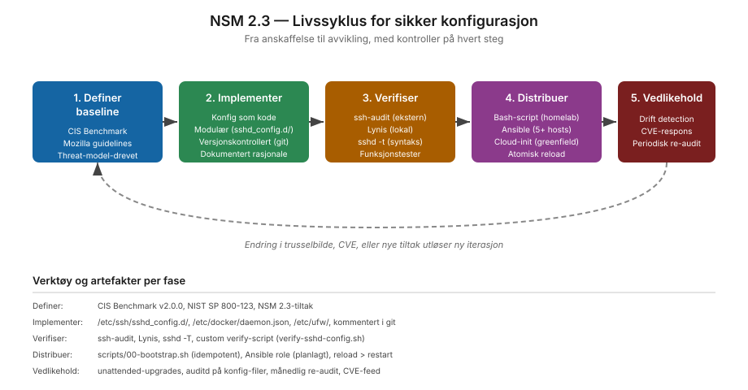

# NSM 2.3 — Ivareta en sikker konfigurasjon

**Dybde-lab på prinsipp 2.3 fra NSM Grunnprinsipper for IKT-sikkerhet versjon 2.1.**

## Hva NSM ber om

Prinsipp 2.3 forutsetter at virksomheten har en sikker konfigurasjon av sine IKT-systemer, definert som baseline, implementert konsekvent, og vedlikeholdt over tid. Konfigurasjonen skal motstå eller begrense skaden fra dataangrep ved å fjerne unødvendig funksjonalitet og slå på sikkerhetstiltak som kommer med plattformen.

I praksis betyr det fire ting:
1. En definert sikker baseline finnes
2. Avvik fra baseline kan oppdages
3. Endringer går gjennom kontrollert prosess
4. Konfigurasjonen oppdateres når trusselbildet endrer seg

## Hva denne lab-en gjør

Tar to eksisterende labs i repoet (`ssh-hardening`, `vps-bootstrap`) og dokumenterer hvordan de implementerer NSM 2.3-tiltakene konkret. Lab-en er bygget rundt fem-fase-livssyklus-modellen som viser hvordan konfig-arbeid faktisk skjer i praksis:

## Innhold

- `teori.md` — Hva NSM 2.3 ber om, paraphrased fra rammeverket. Norsk.
- `praksis.md` — Hvordan ssh-hardening og vps-bootstrap implementerer det, med konkrete filer og kommandoer
- `tiltaksmapping.md` — Hvert NSM 2.3-tiltak mot konkret implementasjon
- `verifisering.md` — Hvordan verifisere at tiltakene faktisk virker, med før/etter-tall
- `examples/` — Konkrete utdrag og eksempler

## Status

| Tiltak | Status | Bevis |
|---|---|---|
| 2.3.1 Sikkerhetsoppdatering | Delvis | unattended-upgrades aktivert, ingen sentralisert patch-mgmt |
| 2.3.2 Eksekverings-kontroll | Delvis (server-context) | noexec på /tmp, Docker read_only, AppArmor på utvalgte tjenester |
| 2.3.3 Deaktiver unødvendig | Implementert | ssh-audit A+, modulær sshd-config med eksplisitte fjerning av legacy |
| 2.3.4 Standard baseline | Implementert | konfig som kode i git, kommentert med rasjonale |
| 2.3.5 Verifisering | Implementert | verify-sshd-config.sh + auditd watches + Sigma-regel |
| 2.3.6 Trygg drift | Implementert | mesh-only admin-aksess, per-host nøkler |
| 2.3.7 Standardpassord | Implementert | SSH pubkey-only fra start; bootstrap verifiserer |
| 2.3.8 Kodebeskyttelse | Implementert | ASLR, NX, SMEP — moderne kernel default |
| 2.3.9 Sikker tid | Implementert | chrony mot pool.ntp.org + ntp.uio.no |
| 2.3.10 IoT | Ikke relevant | VPS-skala har ingen IoT-enheter |

10 av 10 tiltak adressert i tiltaksmapping (8 implementert/delvis, 1 ikke relevant, 1 cross-context). Detaljer i `tiltaksmapping.md`.

## Cross-references

- Praktisk kode: `networking/zero-trust-designs/ssh-hardening/`
- Praktisk kode: `networking/zero-trust-designs/vps-bootstrap/`
- Norsk kontekst: `nsm-grunnprinsipper/master-mapping/`
- Internasjonal sammenheng: NIST SP 800-128, CIS Benchmark, ISO 27002:2022 8.9 (Configuration management)

## Sources

- NSM Grunnprinsipper v2.1, prinsipp 2.3
  https://nsm.no/regelverk-og-hjelp/rad-og-anbefalinger/beskytte-og-opprettholde/ivareta-en-sikker-konfigurasjon/
- NIST SP 800-128 — Guide for Security-Focused Configuration Management
- CIS Distribution Independent Linux Benchmark v2.0.0
- ISO/IEC 27002:2022 — kontroll 8.9
