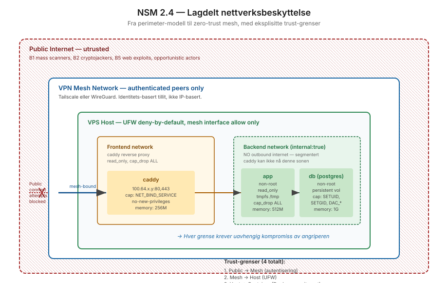

# NSM 2.4 — Beskytt virksomhetens nettverk

**Dybde-lab på prinsipp 2.4 fra NSM Grunnprinsipper for IKT-sikkerhet versjon 2.1.**

## Hva NSM ber om

Prinsipp 2.4 forutsetter at virksomheten beskytter sine nettverk mot uautorisert tilgang og uønsket trafikkflyt. Tradisjonelt har dette vært perimeter-basert (firewall mellom "inne" og "ute"), men moderne tilnærminger erkjenner at det ikke finnes en sikker innside lenger — angripere kan være på allerede kompromitterte hosts, ansatte jobber hjemmefra, og leverandører kobler til fra hvor som helst.

Lab-en demonstrerer overgangen fra perimeter-modell til zero-trust mesh, og hvordan eksisterende `vps-bootstrap`-arbeid implementerer det NSM 2.4 spør om.

## Den større endringen

Norske offentlige virksomheter er midt i en overgang som har implikasjoner for hvordan 2.4 leses:

- **Perimeter-modellen:** Antar at trafikk innenfor perimeteret er pålitelig. VPN var tidlig et "extension" av perimeter — du logget inn på VPN, var "innenfor", og hadde tilgang til alt.
- **Zero-trust:** Antar at ingen trafikk er pålitelig. Hver request autentiseres uavhengig av kilde. VPN-mesh blir et identitets-lag, ikke et tillit-lag.

NIST SP 800-207 (Zero Trust Architecture) er nå mainstream i offentlig sektor i Norge, og NSM 2.4-tiltakene har blitt skrevet om for å støtte zero-trust uten å eksplisitt navngi det. Lab-en gjør koblingen synlig.

## Innhold

- `teori.md` — Hva NSM 2.4 ber om, paraphrased og koblet til zero-trust-prinsipper
- `praksis.md` — Hvordan vps-bootstrap implementerer det konkret, med fire trust-grenser
- `tiltaksmapping.md` — Hvert NSM 2.4-tiltak mot konkret implementasjon

## Status

| Tiltak | Status | Bevis |
|---|---|---|
| 2.4.1 Tilgangskontroll på porter (fysisk/trådløst/virtuelt) | Implementert (virtuell), n/a (fysisk/trådløs) | UFW per-interface, Tailscale ACL, Docker `iptables: false` |
| 2.4.2 Kryptering trådløse/kablede forbindelser | Implementert | Mesh-VPN, SSH AEAD ciphers, TLS i Caddy |
| 2.4.3 Kartlegg fysisk tilgjengelighet for svitsjer/kabler | Ikke relevant (VPS) | Delegert til datasenter-leverandør via SLA |
| 2.4.4 Aktiver brannmur på alle klienter og servere | Implementert | UFW default deny + per-interface allow, logs shipped |

## Cross-references

- Praktisk kode: `networking/zero-trust-designs/vps-bootstrap/`
- Klient-side: `networking/zero-trust-designs/ssh-hardening/client-config/`
- Threat model: `vps-bootstrap/THREAT-MODEL.md` (B1-B6 actor classes)
- Internasjonal sammenheng: NIST SP 800-207, Forrester ZTX, Google BeyondCorp papers

## Sources

- NSM Grunnprinsipper v2.1, prinsipp 2.4
  https://nsm.no/regelverk-og-hjelp/rad-og-anbefalinger/beskytte-og-opprettholde/beskytt-virksomhetens-nettverk/
- NIST SP 800-207 — Zero Trust Architecture
- "BeyondCorp: A New Approach to Enterprise Security" (Google) — fundamentale paper
