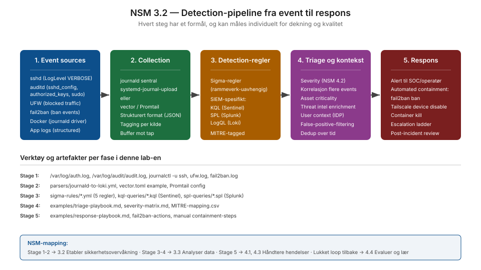

# NSM 3.2 — Etabler sikkerhetsovervåkning

**Dybde-lab på prinsipp 3.2 fra NSM Grunnprinsipper for IKT-sikkerhet versjon 2.1.**

## Hva NSM ber om

Prinsipp 3.2 forutsetter at virksomheten har en aktiv sikkerhetsovervåkning som samler logger og hendelser fra IKT-systemene, og kan analysere disse for å oppdage avvik fra normaltilstand.

Dette er detection-siden av forsvar — komplementær til hardening-siden i kategori 2. En perfekt hardenet stack uten overvåkning er som å ha topp lås på døra uten alarm: hvis noen kommer seg gjennom, har du ingen måte å vite det på.

## Hvorfor denne laben er kritisk for porteføljen

Mange BSc-portefoljer fokuserer enten kun på offensive (CTF, HTB writeups) eller kun på hardening (Linux config, SSH lock-down). Få har detection-side på samme nivå. Det skiller en kandidat for SOC-rolle (mnemonic, NORMA Cyber, defensive konsulenthus) fra en kandidat som bare ser halvparten av bildet.

Lab-en bygger på auditd-regler og LogLevel VERBOSE-konfig som ble etablert i `vps-bootstrap` og `ssh-hardening`, og demonstrerer hvordan den telemetri-en faktisk brukes til å detektere angrep.

## Innhold

- `teori.md` — Hva NSM 3.2 ber om, koblet til SOC-praksis
- `praksis.md` — Pipeline-steg for steg, fra log-kilder til respons
- `tiltaksmapping.md` — NSM 3.2-tiltak mot konkret implementasjon
- `sigma-rules/` — 5 ferdige Sigma-regler som dekker SSH, sudo, Docker socket, auditd
- `kql-queries/` — Microsoft Sentinel KQL-versjoner av samme deteksjoner
- `spl-queries/` — Splunk SPL-versjoner
- `parsers/` — Eksempel-konfigurasjoner for log shipping (journald, vector, Promtail)
- `examples/` — Triage- og responseplaybooks

## Status

| Tiltak | Status | Bevis |
|---|---|---|
| 3.2.1 Strategi og retningslinjer | Implementert (dok-nivå) | teori.md, praksis.md med eksplisitte valg |
| 3.2.2 Lover og regler | Delvis | GDPR-betraktninger dokumentert i parsers/journald-to-loki.md |
| 3.2.3 Hvilke deler å overvåke | Implementert | 8 log-kilder mappet mot threat-model A1-A5/B1-B6 |
| 3.2.4 Hvilke data å samle | Implementert | LogLevel VERBOSE, auditd watches, Docker journald driver |
| 3.2.5 Verifisering av innsamling | Implementert | Coverage-test-prosedyre, strukturert JSON via Vector |
| 3.2.6 Beskyttelse mot manipulering | Implementert | auditd `-e 2`, watch på log-filer, ekstern shipping |
| 3.2.7 Periodisk gjennomgang | Delvis | Triage-playbook med kvartalsvis review |

## Cross-references

- Hardening-side: `2-3-sikker-konfigurasjon/` (samme repo)
- Log-kilder: `networking/zero-trust-designs/ssh-hardening/server-config/sshd_config.d/40-audit.conf`
- Auditd-regler: `networking/zero-trust-designs/vps-bootstrap/scripts/00-bootstrap.sh`
- Internasjonal sammenheng: NIST CSF 2.0 DE.CM, MITRE ATT&CK Detection Mapping

## Sources

- NSM Grunnprinsipper v2.1, prinsipp 3.2
  https://nsm.no/regelverk-og-hjelp/rad-og-anbefalinger/oppdage/etabler-sikkerhetsovervakning/
- Sigma-prosjektet (SigmaHQ): https://sigmahq.io
- MITRE ATT&CK Enterprise: https://attack.mitre.org/
- Microsoft Sentinel KQL reference: https://learn.microsoft.com/en-us/azure/azure-monitor/logs/kusto-overview
