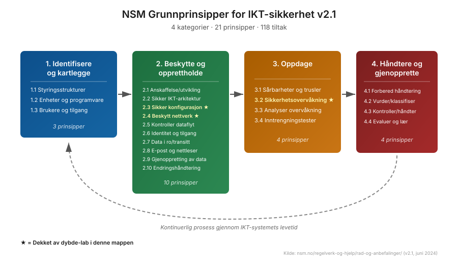
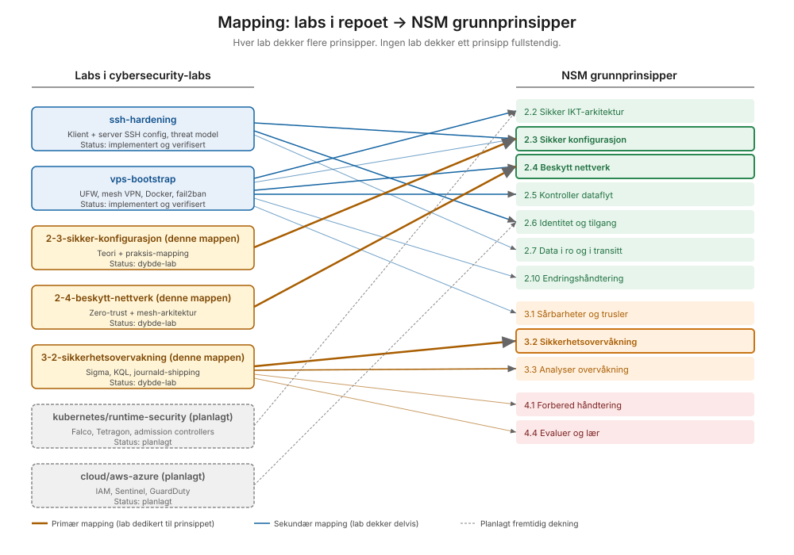

# Master Mapping — labs i repoet til NSM grunnprinsipper

## Hva dette er

En oversiktstabell over hvilke NSM-prinsipper som dekkes av hvilke labs i `cybersecurity-labs`. Tabellen er ærlig om dekningsgrad: ikke alt er fullt implementert, og det er bevisst.

## Hvordan lese tabellen

Hver rad er ett NSM-prinsipp. Kolonnene viser:

- **Prinsipp:** referanse og navn fra NSM v2.1
- **Hovedlab:** primærlaben som demonstrerer prinsippet i dybde
- **Andre labs:** sekundære labs som også berører prinsippet
- **Status:** modenhet — `Implementert og verifisert`, `Implementert`, `Delvis`, `Ikke relevant for hjemmelab-skala`, `Planlagt`
- **NIST mapping:** hvor det matches mot NIST CSF 2.0 eller NIST SP 800-53

Detaljer per lab i `mapping-tabell.md`. Modenhetsvurdering per prinsipp i `modenhetsvurdering.md`.

## Hvordan labs henger sammen

## Cross-walk mot internasjonale rammeverk

NSM grunnprinsipper er ikke en isolert standard. De fleste tiltak korresponderer med NIST CSF 2.0, ISO 27002:2022, og MITRE D3FEND. Hovedforskjellene:

| Aspekt | NSM | NIST CSF 2.0 | ISO 27002:2022 |
|---|---|---|---|
| Form | Anbefalingssett | Funksjon-rammeverk | Kontroll-katalog |
| Kategorier | 4 (Identifisere, Beskytte, Oppdage, Håndtere) | 6 (Govern, Identify, Protect, Detect, Respond, Recover) | 4 (Organizational, People, Physical, Technological) |
| Antall tiltak | 118 | ~108 underkategorier | 93 kontroller |
| Compliance-status | Anbefaling | Anbefaling | Sertifiseringsbasis |
| Norsk-spesifikt | Ja, refererer sikkerhetsloven | Nei | Nei |
| Skytjeneste-fokus | Egen seksjon i v2.1 | Generelt | ISO 27017 separat |

NSM v2.1 introduserte i 2024 en eksplisitt seksjon om bruk av tjenesteutsetting og skytjenester — det er der norske offentlig-sektor-aktører finner spesifikke anbefalinger som ikke fanges av rene amerikanske rammeverk.

## Når noen spør "men dekker dette ISO 27001?"

Nei, og det er bevisst. ISO 27001 handler om Information Security Management System (ISMS) — altså hvordan en organisasjon styrer sikkerhetsarbeidet sitt over tid. Det er en sertifiseringsstandard som kan kjøres revisjon mot. Det krever mye mer enn tekniske tiltak: dokumenterte prosesser, ledelsesinvolvering, intern revisjon, korrigerende tiltak, kontinuerlig forbedring.

NSM grunnprinsipper og ISO 27002 (kontrollkatalogen som ISO 27001 lener seg på) overlapper på det tekniske nivået. Disse labs demonstrerer det tekniske nivået. Det organisatoriske rundt — risk management policy, asset register som vedlikeholdes formelt, incident response runbook med øvelser — er en virksomhets-skala konsept som ikke gir mening å fake i et BSc-portfolio.

Hva en hiring manager bør lese ut av dette: kandidaten forstår skillet mellom teknisk implementasjon og organisatorisk styring, og har valgt å dypdykke i det tekniske fordi det er det som er relevant for en junior cloud/security engineer-rolle.
