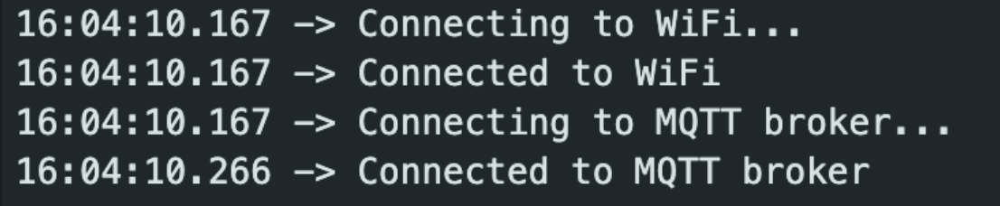
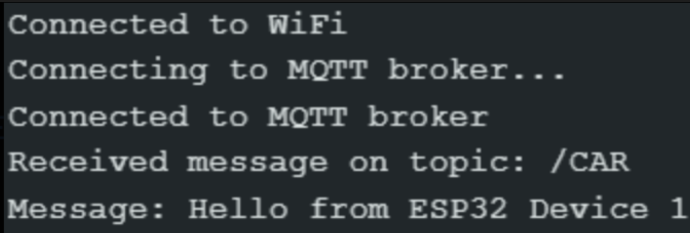

# ESP32 MQTT IoT — Publisher/Subscriber Lab

**Technique:** MQTT publish/subscribe over Wi-Fi  
**Tools:** Arduino IDE, ESP32, PubSubClient library  
**Environment:** Lab IoT network (LAB-IOT-NET)

---

## Objective

- Connect two ESP32 microcontrollers to the same Wi-Fi network and MQTT broker
- Demonstrate device-to-device communication using the publish/subscribe model
- Understand the security implications of unencrypted MQTT (port 1883)

## Setup

| Role | Device |
|------|--------|
| Publisher (sender) | ESP32 Dev Module |
| Subscriber (receiver) | ESP32 Dev Module |
| Broker | MQTT broker at 192.168.1.254 |
| Network | LAB-IOT-NET |

**Libraries required:**
```cpp
#include <WiFi.h>
#include <PubSubClient.h>
```

> Note: Set board to **ESP32 Dev Module** in Arduino IDE — boards marked "Feather" may fail to compile.

---

## How It Works

The publisher connects to Wi-Fi and the MQTT broker, then sends a message to the topic `/CAR` every 5 seconds. The subscriber listens on the same topic and prints received messages to the Serial Monitor.

```
Publisher  →  [topic: /CAR]  →  Broker  →  Subscriber
```

---

## Sender Code

```cpp
const char* ssid = "LAB-IOT-NET";
const char* password = "LAB-IOT-NET2023";
const char* broker_url = "192.168.1.254";
const char* topic = "/CAR";

void loop() {
    client.loop();
    String message = "Hello from ESP32 Device 1";
    client.publish(topic, message.c_str());
    delay(5000); // publish every 5 seconds
}
```

## Receiver Code

```cpp
void callback(char* topic, byte* payload, unsigned int length) {
    Serial.print("Received message on topic: ");
    Serial.println(topic);
    Serial.print("Message: ");
    for (int i = 0; i < length; i++) {
        Serial.print((char)payload[i]);
    }
    Serial.println();
    client.publish("/CAR/Received", (char*)payload, length);
}
```

---

## Walkthrough

### 1. Sender — connected to Wi-Fi and broker, publishing



### 2. Receiver — message received on topic /CAR



---

## Security Considerations

This lab uses **unencrypted MQTT on port 1883** — all messages are visible in plaintext on the network. In a production environment:

- Use **TLS encryption** (port 8883) for secure transmission
- Enable **authentication** (username/password) in broker config
- Use **QoS levels 1 or 2** for reliable delivery
- Implement **network segmentation** (VLANs) to isolate IoT devices

## Troubleshooting

- Stuck on `Connecting to WiFi...` → check SSID/password and board selection
- MQTT connection fails → verify broker IP and that port 1883 is open
- Use `WiFi.localIP()` to confirm the ESP32 received a valid IP
- No message received → ensure both devices use the **exact same topic name**

---

[← Back to overview](../README.md)
