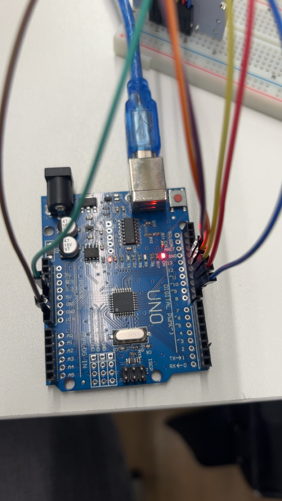
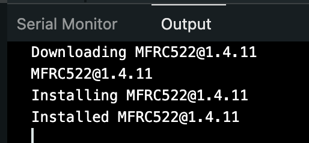
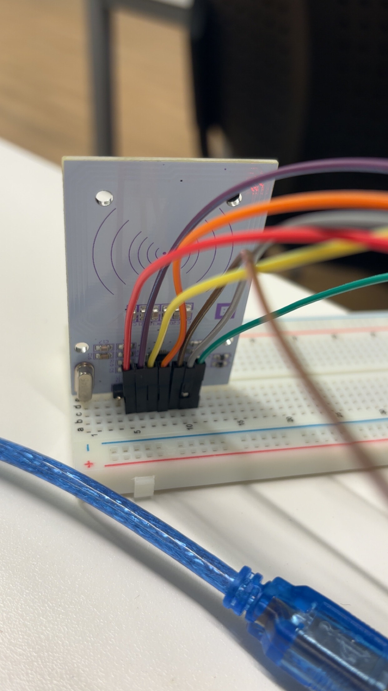
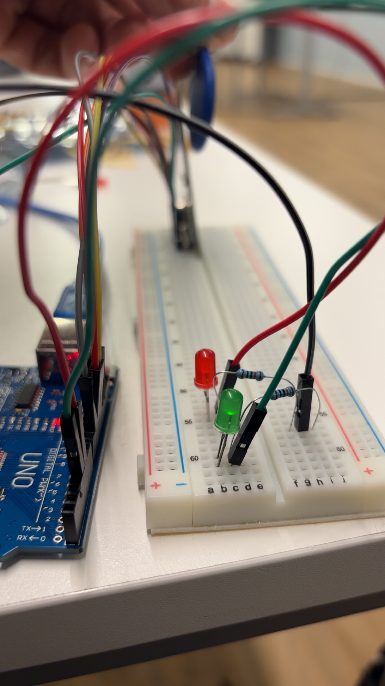
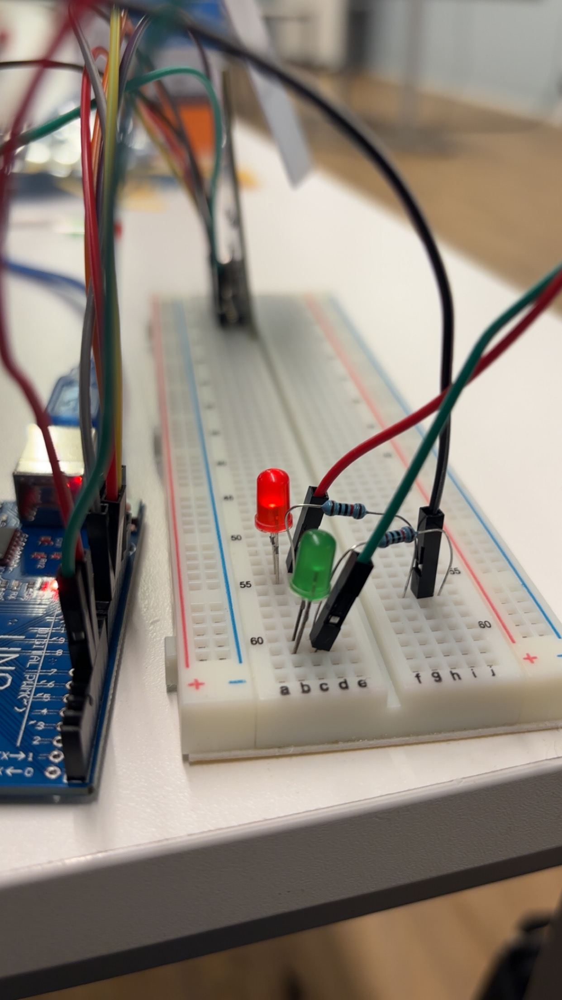

# RFID Access Control — Arduino + MFRC522

**Technique:** RFID UID reading and access control logic  
**Tools:** Arduino IDE, MFRC522 library v1.4.11  
**Hardware:** Arduino UNO, MFRC522 reader, MIFARE Classic 1K cards/fobs, LEDs

---

## Objective

- Wire the MFRC522 RFID reader to Arduino via SPI and read card UIDs
- Implement access control logic: grant or deny based on a stored UID
- Add visual feedback using red (denied) and green (granted) LEDs

## Components

| Component | Details |
|-----------|---------|
| Arduino UNO | ATmega328P microcontroller |
| MFRC522 RFID reader | SPI interface, 3.3V only |
| RFID cards/fobs | MIFARE Classic 1K |
| LEDs | 1× red (pin 5), 1× green (pin 4) |
| Resistors | 2× 220Ω |
| Transistor | NPN (for LED current control) |

> **Important:** VCC must be connected to **3.3V**, not 5V — 5V will permanently damage the MFRC522.

---

## Wiring (RC522 → Arduino UNO)

| RC522 Pin | Arduino Pin | Description |
|-----------|-------------|-------------|
| VCC | 3.3V | Power — 3.3V only! |
| GND | GND | Common ground |
| RST | D9 | Reset |
| NSS (SDA) | D10 | Slave select (SPI) |
| MOSI | D11 | Data to reader |
| MISO | D12 | Data from reader |
| SCK | D13 | SPI clock |
| IRQ | — | Not used |

---

## Walkthrough

### Hardware setup






---

### Task 1 — Read RFID UID

Scans any card and prints its UID to the Serial Monitor.

```cpp
#include <SPI.h>
#include <MFRC522.h>

#define RST_PIN 9
#define SS_PIN 10

MFRC522 mfrc522(SS_PIN, RST_PIN);

void setup() {
    Serial.begin(9600);
    SPI.begin();
    mfrc522.PCD_Init();
    Serial.println("Scan PICC to see UID...");
}

void loop() {
    if (!mfrc522.PICC_IsNewCardPresent()) return;
    if (!mfrc522.PICC_ReadCardSerial()) return;
    mfrc522.PICC_DumpToSerial(&(mfrc522.uid));
}
```

**Example detected UID:** `AD D8 53 59`

---

### Task 2A — Access control (Serial Monitor only)

Compares scanned UID against a stored authorized UID.

```cpp
byte accessUID[4] = { 0xAD, 0xD8, 0x53, 0x59 };

// In loop():
if (mfrc522.uid.uidByte[0] == accessUID[0] && ...) {
    Serial.println("Access Granted");
} else {
    Serial.println("Access Denied");
}
```


---

### Task 2B — Visual feedback with LEDs

Green LED (pin 4) lights up for access granted, red LED (pin 5) for denied.

```cpp
#define GREEN_LED_PIN 4
#define RED_LED_PIN 5

// Access granted:
digitalWrite(GREEN_LED_PIN, HIGH);
digitalWrite(RED_LED_PIN, LOW);

// Access denied:
digitalWrite(GREEN_LED_PIN, LOW);
digitalWrite(RED_LED_PIN, HIGH);

delay(2000); // hold for 2 seconds, then turn off
```

| Hardware | Access granted | Access denied |
|----------|---------------|---------------|
|  |  |  |

Serial monitor showing both outcomes:



---

## Security Considerations

Using card UID alone is **not secure** — UIDs can be cloned or spoofed. A more robust implementation would include:

- Cryptographic authentication (e.g., MIFARE DESFire with AES)
- Encrypted data transmission (MQTT/HTTPS over TLS)
- Centralized logging and monitoring of access events
- Physical tamper detection on the reader

## Key Takeaways

- Proper grounding and short cables are critical for stable SPI communication
- The transistor acts as a switch to safely deliver current to LEDs from Arduino
- This pattern scales directly to real IoT access systems — the same logic applies to solenoid locks, buzzers, and cloud-connected platforms

---

[← Back to overview](../README.md)
