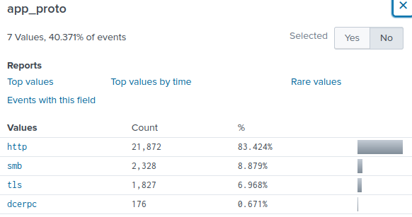
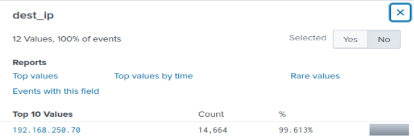
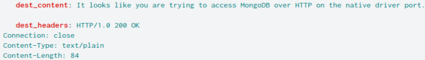
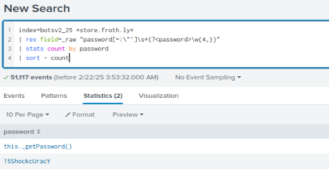
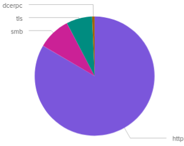
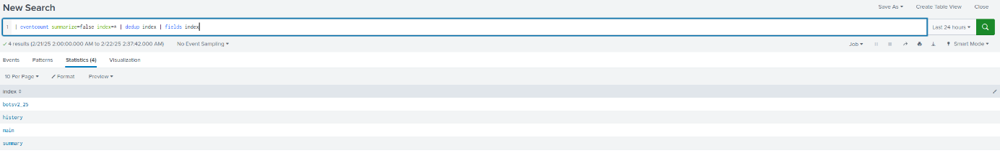
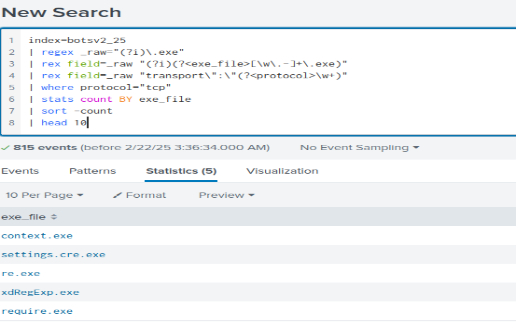

# Splunk BOTSv1 – SOC-analyse

> **Datasett:** Boss of the SOC v1 | **Verktøy:** Splunk SPL + Suricata
> **Mål:** Rekonstruere fullstendig angrepsforløp mot `imreallynotbatman.com`

## Funn 1 – Rekognosering
**MITRE T1595.002 – Active Scanning**
```splunk
index="botsv1" earliest=0
    hostname="imreallynotbatman.com"
    attack="Acunetix.Web.Vulnerability.Scanner"
```


**Funn:** `40.80.148.42` kjørte Acunetix mot webserveren.

## Funn 2 – Webserver identifisert
```splunk
index="botsv1" earliest=0 server="Microsoft-IIS/8.5"
| stats count by dest_ip, server
```


**Funn:** `192.168.250.70:80` kjører `Microsoft-IIS/8.5`.

## Funn 3 – XSS via Suricata
**MITRE T1190 – Exploit Public-Facing Application**
```splunk
index="botsv1" earliest=0
    sourcetype="suricata" "Cross Site Scripting"
| stats count by src_ip, dest_ip, alert.signature
```


**Funn:** `40.80.148.42` trigget XSS-varsler.

## Funn 4 – Vellykket pålogging
**MITRE T1078 – Valid Accounts**
```splunk
index="botsv1" earliest=0 192.168.250.40:8191
```
**Funn:** `192.168.2.50` fikk `200 OK`.

## Funn 5 & 6 – Brute Force
**MITRE T1110 – Brute Force**
```splunk
index="botsv1" earliest=0 http_method=POST imreallynotbatman.com NOT Acunetix
| top limit=0 form_data | regex form_data="passwd=s.*"

index="botsv1" earliest=0 http_method=POST imreallynotbatman.com NOT Acunetix
| regex form_data="passwd=\.\d"
```


**Funn:** 39 s-passord, 33 tallpassord.

## Funn 7 & 8 – Lateral Movement + Credential Dumping
**MITRE T1021.002 + T1003**
```splunk
index=botsv1 sourcetype=stream:smb
| stats count by src_ip, dest_ip | sort - count

index=botsv1 sourcetype=stream:smb src_ip="192.168.2.50"
| stats count by src_ip, dest_ip, filename | sort - count | head 20
```


**Funn:** `192.168.2.50` → `.100` og `.20` med SAM, LSA, Remote Registry.

## Funn 9 – DNS-tunneling
**MITRE T1071.004 – DNS**
```splunk
index=botsv1 sourcetype=stream:dns | top limit=10 query{}
```


**Funn:** `FHFAEBEECACACACACACACACACACAAA` (456 treff).

## Funn 10 – Trafikkvolum
```splunk
index="botsv1" sourcetype=stream:http | timechart span=1d sum(bytes)
index="botsv1" | timechart sum(bytes) as datavolum
```


**Funn:** Høyest volum `2016-08-11` – 169 MB.

## Angrepsforløp
```
T1595  REKOGNOSERING  → 40.80.148.42 scanner med Acunetix
T1190  EXPLOIT        → XSS mot Microsoft-IIS/8.5
T1110  BRUTE FORCE    → 72 passord-forsøk via HTTP POST
T1078  VALID ACCOUNTS → 192.168.2.50 logger inn (200 OK)
T1021  LATERAL MOVE   → SMB til .100 og .20
T1003  CRED DUMP      → SAM, LSA, Remote Registry
T1071  EXFILTRATION   → DNS-tunneling med kodede queries
```
