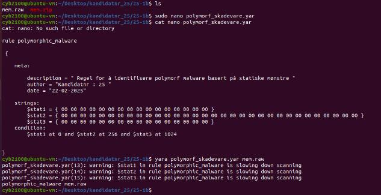
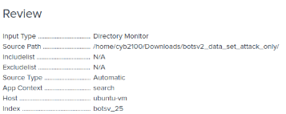
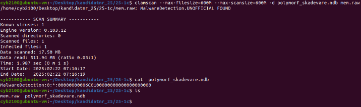

# YARA Rules

| Fil | Mål | MITRE |
|-----|-----|-------|
| `phishing_macro.yar` | VBA-makro i spearphishing Office-dokument | T1566.001, T1105 |
| `polymorphic.yar` | Polymorf skadevare via byte-offset-mønstre | T1027.007 |

## Kjøring
```bash
yara phishing_macro.yar Teena_decrypted.docm
yara polymorphic.yar mem.raw
yara -r *.yar /path/to/scan/
```

## phishing_macro.yar – Analyseprosess
```bash
python3 -m msoffcrypto Teena.docm Teena_decrypted.docm -p "1337"
python3 -m oletools.olevba Teena_decrypted.docm
```




## polymorphic.yar – ClamAV skanning
```bash
sigtool --md5 wzdu35.exe > custom.hdb
clamscan --database=custom.hdb /path/
```


