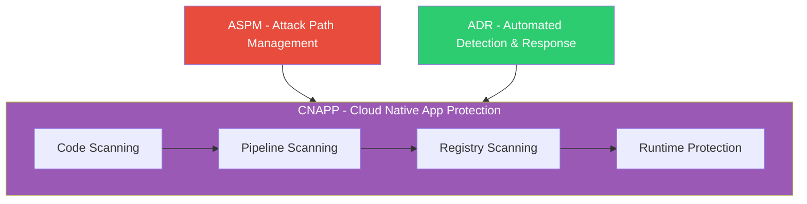
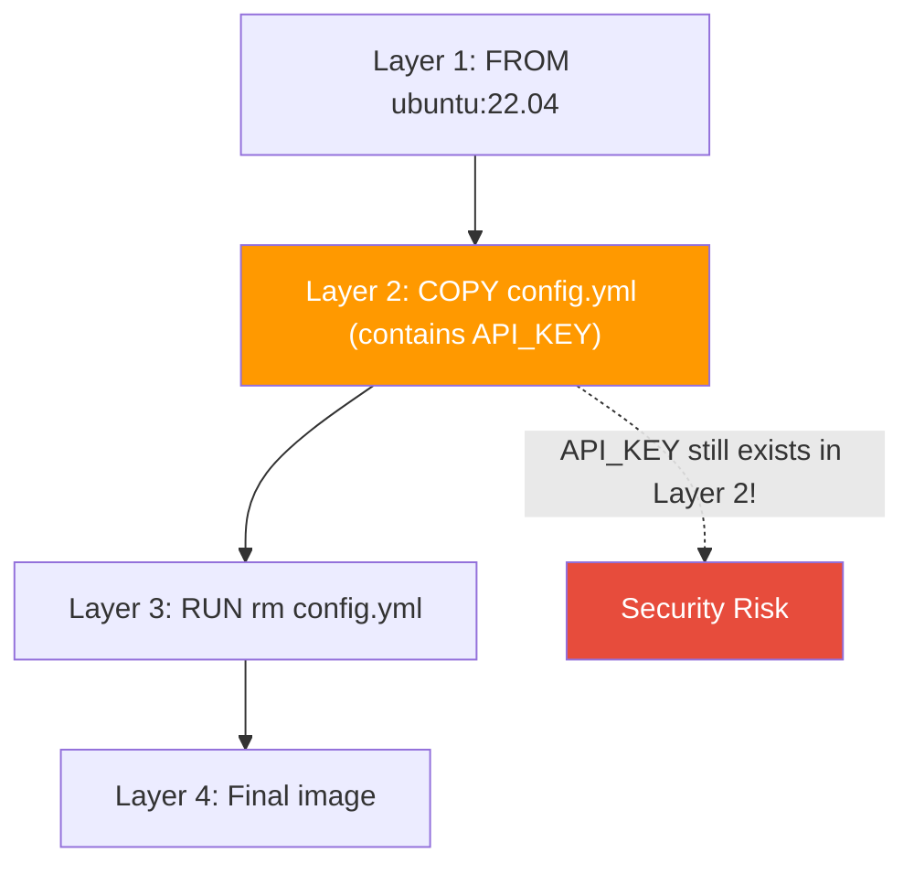
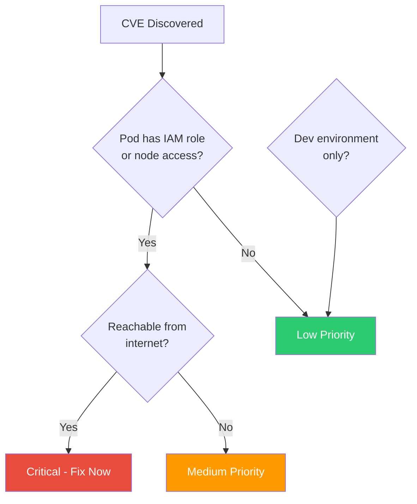

# 🐳 AWS Day of Containers with Wiz & O3C CTF


Notes from the AWS Day of Containers event with Wiz and O3 Cyber CTF. Covers container security, Kubernetes attack surfaces, image hygiene, and cloud-native application protection.

---

## Key Concepts

### Cloud-Native Security Stack



**CNAPP (Cloud Native App Protection Platform):** Unified security from code to cloud to runtime. Combines CSPM, CWPP, and supply chain security.

**ASPM (Attack Path / App Security Posture Management):** Prioritize vulnerabilities based on actual exploitability, not just CVSS scores. A CVE in a pod with IAM access to secrets is critical. The same CVE in an isolated dev container is low priority.

**ADR (Automated Detection & Response):** Runtime monitoring with automated remediation. Detect anomalies, trigger playbooks, contain threats.

**Key metric — MTTR (Mean Time To Remediate):** The most important KPI for container security maturity.

---

## Docker Image Security

### Why Layers Matter

Every Dockerfile instruction (`RUN`, `COPY`, `ADD`) creates a new layer. Sensitive data written in an early layer persists in the image history — even if you delete it in a later layer.



> [!WARNING]
> Deleting a secret in a later layer does NOT remove it from the image. The secret remains in the earlier layer and can be extracted by anyone with access to the image.

### Finding Secrets in Image Layers (CTF Exercise)

```bash
# 1) Pull and save the image locally
docker pull myrepo/myapp@sha256:<digest>
docker save -o myapp.tar myrepo/myapp@sha256:<digest>

# 2) Extract the tar archive
mkdir /tmp/myapp && tar -xf myapp.tar -C /tmp/myapp

# 3) Inspect the manifest for layer filenames
cat /tmp/myapp/manifest.json | python3 -m json.tool

# 4) Search each layer for secrets
for L in /tmp/myapp/*/layer.tar; do
  mkdir /tmp/layer && tar -xf "$L" -C /tmp/layer
  grep -rI -E "AKIA|api_key|password|secret|BEGIN PRIVATE KEY" /tmp/layer || true
  rm -rf /tmp/layer
done
```

**Learning:** Secrets can survive in layer history. Never put secrets in Dockerfiles. Use secret managers (AWS Secrets Manager, HashiCorp Vault) and mount secrets at runtime.

### Best Practices

- Use minimal base images (alpine, distroless) to reduce attack surface
- Use multi-stage builds to exclude build tools from final image
- Never use `ENV` or build args for secrets
- Scan images in CI pipeline (Trivy, Snyk, Clair) before pushing to registry
- Use `--chown` when copying files to avoid running as root

---

## Mutable Tags Problem

The tag `:latest` or `:1.2` can be re-pushed to a registry with completely different contents. Without verifying the digest, you have no guarantee of what is actually running.

| Approach | Security | Example |
|----------|----------|---------|
| Mutable tag | Unsafe | `myrepo/myapp:latest` |
| Immutable digest | Safe | `myrepo/myapp@sha256:abc123...` |

**Best practice:** Always reference images by SHA256 digest in production. Enable immutability policies on your container registry (ECR, GCR, ACR all support this). Sign images with cosign or Notary for provenance verification.

---

## Kubernetes Security

### Static Pods — Hidden Persistence

Static pods are defined by manifest files on the node filesystem (`/etc/kubernetes/manifests/`), started directly by kubelet without the API server. This makes them dangerous:

- An attacker with node access can drop a static pod manifest
- The pod runs with whatever privileges are in the manifest (including host mounts)
- `kubectl get pods -A` shows static pods alongside regular pods — hard to distinguish
- Logging may not capture static pod activity through central logging pipelines

**Mitigation:** Restrict node access, harden node OS, implement node attestation, monitor `/etc/kubernetes/manifests/` for unexpected changes.

### Helm Template Injection

Unsanitized values in Helm templates can lead to object injection or manifest manipulation. A compromised chart repo or hijacked `values.yaml` can be used to exfiltrate secrets or escalate privileges.

```bash
# Render templates locally to inspect before deploying
helm template myrelease ./chart

# Validate rendered manifests
helm template myrelease ./chart | kubeval

# Dry-run against the cluster
kubectl apply --dry-run=server -f rendered.yaml
```

**Mitigation:** Vet chart repositories, sign charts, scan for `exec`, `hostPath`, `hostNetwork` in rendered manifests. Use OPA/Gatekeeper policies for admission control.

---

## Attack Path Prioritization

Not all vulnerabilities are equal. Prioritize based on actual exploitability:



**Principle:** Prioritize attack paths, not all vulnerabilities. Focus on CVEs that provide a path to sensitive resources (IAM credentials, S3 buckets, database connections).

**Example priority ranking:**
1. RCE in a pod with IAM role or node access — **critical**
2. RCE in an internet-facing service without sensitive access — **high**
3. Vulnerability in a dev image without production access — **low**

---

## Cloud Security Maturity Roadmap

| Phase | Focus | Key Actions |
|-------|-------|-------------|
| 1. Visibility | Know what you have | Cloud event logs, flow logs, asset inventory |
| 2. Hardening | Reduce attack surface | Immutable images, least privilege IAM, network policies |
| 3. Detection | Find threats in runtime | Runtime agents, EDR/MDR, anomaly detection |
| 4. Response | Contain and recover | Automated playbooks, forensics, recovery procedures |

**Measurable KPIs:** MTTR, time to detect, % images scanned in pipeline, % images deployed by digest, number of critical attack paths open.

---

## Tools Referenced

| Tool | Purpose |
|------|---------|
| **Wiz** | CNAPP — contextualization, attack graphs, pipeline scanning |
| **Trivy / Snyk** | Image and code vulnerability scanning |
| **GuardDuty / Detective** | AWS runtime detection and forensics |
| **Prowler** | AWS CIS benchmark hardening checks |
| **cosign / Notary** | Image signing and provenance verification |
| **OPA / Gatekeeper** | Kubernetes admission control policies |

---

## Takeaway Checklist

- [ ] Reference images by SHA256 digest in production deployments
- [ ] Enable image scanning in CI pipeline (fail on high/critical findings)
- [ ] Move secrets to a secret manager — never hardcode in Dockerfiles
- [ ] Configure registry immutability policy
- [ ] Create a remediation playbook: finding → triage → PR → close ticket
- [ ] Map attack paths: which pods/services have IAM access to sensitive data
- [ ] Measure MTTR as your primary security metric

---

[⬅️ Back to AWS Study Notes](../)
