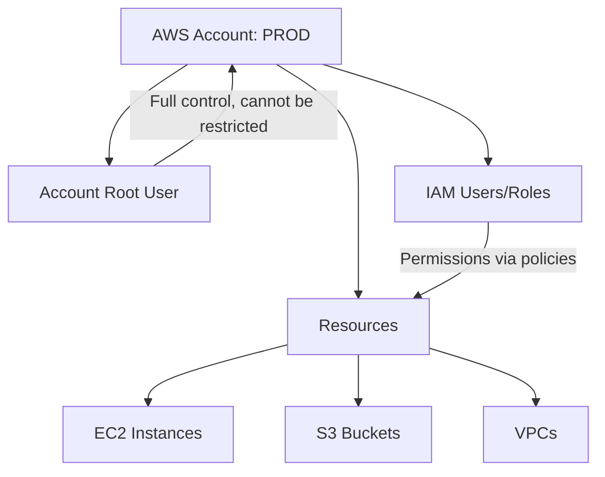

# Section 1: AWS Accounts & Exam Overview

## Exam Structure

AWS certifications are organized in three tiers:

**Foundational:** Cloud Practitioner (CLF-C02) — broad overview, no technical depth.
**Associate:** Solutions Architect, Developer, SysOps — role-based, hands-on skills. Start here.
**Professional:** Solutions Architect Pro, DevOps Engineer Pro — builds on associate, deeper and wider.
**Specialty:** Security, Networking, Machine Learning, etc. — narrow and deep on specific domains.

> [!TIP]
> Professional exams build on associate knowledge. Complete associate first. Specialty certifications are best saved for last unless you already have deep domain expertise.

## What Is an AWS Account

An AWS account is a **container** for identities (users) and resources (EC2, S3, VPCs, etc.). It is not just a login — it is an isolation boundary.



**Creating an account requires:** A unique account name (e.g., PROD), a unique email address, and a credit card (can be reused across accounts).

## Account Root User

The account root user has **full, unrestricted control** over everything in the account. It cannot be limited by any policy. This is why you should never use the root user for daily tasks.

> [!WARNING]
> The root user should only be used for initial account setup and tasks that specifically require root. Use IAM users/roles for everything else.

## Multi-Account Strategy

AWS best practice: use separate accounts for separate purposes.

| Account | Purpose |
|---------|---------|
| PROD | Production workloads |
| DEV | Development and testing |
| SECURITY | Centralized logging and security tools |
| SHARED | Shared services (DNS, CI/CD) |

**Why separate accounts?** Each account is a blast radius boundary. An admin mistake or security breach in DEV cannot affect PROD. External identities are denied by default — no cross-account access unless explicitly granted.

```bash
# List all accounts in an AWS Organization
aws organizations list-accounts --output table

# Get current account identity
aws sts get-caller-identity
```

---

[⬅️ Back to AWS SAA-C03 Index](../)
