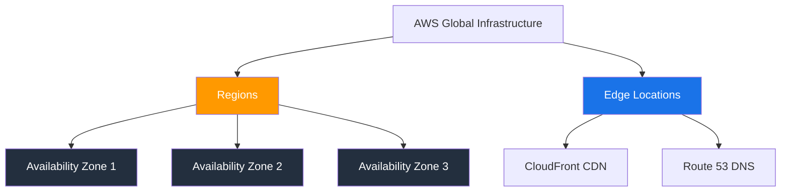

# Section 2: AWS Cloud Fundamentals

## AWS Global Infrastructure

**Regions:** Geographic areas with full AWS infrastructure. 30+ regions. Each region is isolated (fault tolerance, data sovereignty). Choose region based on: compliance/legal requirements, proximity to users, service availability, pricing.

**Availability Zones (AZs):** Physically separate datacenters within a region. Connected by high-bandwidth low-latency networking. Minimum 3 AZs per region. Design for multi-AZ to survive datacenter-level failure.

**Edge Locations:** 400+ locations worldwide for content delivery (CloudFront) and DNS (Route 53). Much more numerous than regions.

## AWS vs Azure Comparison

| Concept | AWS | Azure |
|---------|-----|-------|
| Identity | IAM | Entra ID |
| Virtual machines | EC2 | Virtual Machines |
| Object storage | S3 | Blob Storage |
| Virtual network | VPC | VNet |
| Load balancer | ELB (ALB/NLB) | Azure Load Balancer |
| Serverless | Lambda | Functions |
| Container orchestration | EKS / ECS | AKS |
| SIEM | Security Lake | Sentinel |
| Threat detection | GuardDuty | Defender for Cloud |

> [!NOTE]
> Knowing both AWS and Azure terminology is a strong differentiator in job interviews. Most organizations use multi-cloud or are migrating between providers.

## Shared Responsibility Model (AWS)

Same concept as Azure but AWS-specific terminology:

**AWS responsibility ("Security OF the cloud"):** Physical infrastructure, hardware, networking, hypervisor, managed service internals.

**Customer responsibility ("Security IN the cloud"):** Data, access management, OS configuration, network/firewall rules, encryption, application code.

The split depends on the service: EC2 (IaaS) = most customer responsibility, RDS (PaaS) = less, S3 (managed) = even less, Lambda (serverless) = least.

---

[⬅️ Back to AWS SAA-C03 Index](../)
