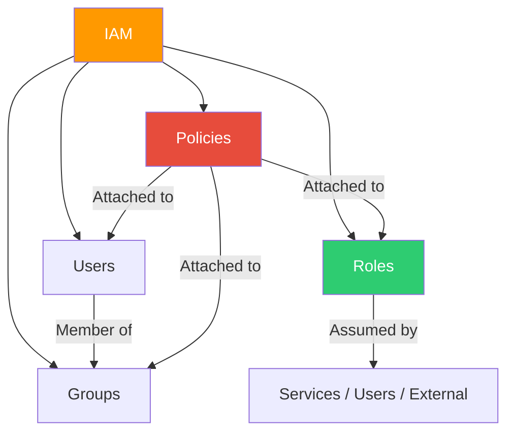

# Section 3: IAM (Identity and Access Management)

## IAM Overview

IAM is a **global service** — not region-specific. It controls who (authentication) can do what (authorization) on which resources.



## Key Components

**Users:** Represents a person or application. Has long-term credentials (password for console, access keys for CLI/API). Best practice: one user per person, never share credentials.

**Groups:** Collection of users. Cannot be nested (no groups in groups). A user can belong to multiple groups. Groups cannot be used as principals in resource-based policies.

**Roles:** Temporary identity assumed by users, services, or external accounts. No long-term credentials — uses short-lived tokens via STS. This is the recommended approach for most scenarios.

**Policies:** JSON documents defining permissions. Types: identity-based (attached to user/group/role), resource-based (attached to resources like S3 buckets), service control policies (attached to Organizations).

## Policy Evaluation Logic

1. By default, all requests are **denied** (implicit deny)
2. An explicit **allow** overrides the implicit deny
3. An explicit **deny** always overrides any allow
4. Boundaries (SCPs, permission boundaries) can limit maximum permissions

> [!IMPORTANT]
> Deny always wins. If any policy denies access, the request is denied regardless of other allow statements.

## Policy Example

```json
{
  "Version": "2012-10-17",
  "Statement": [
    {
      "Effect": "Allow",
      "Action": "s3:GetObject",
      "Resource": "arn:aws:s3:::my-bucket/*"
    },
    {
      "Effect": "Deny",
      "Action": "s3:*",
      "Resource": "arn:aws:s3:::my-bucket/confidential/*"
    }
  ]
}
```

## CLI Examples

```bash
# List all IAM users
aws iam list-users --output table

# Create a new user
aws iam create-user --user-name developer1

# Attach a policy to a user
aws iam attach-user-policy --user-name developer1 \
  --policy-arn arn:aws:iam::aws:policy/ReadOnlyAccess

# List roles
aws iam list-roles --query "Roles[].RoleName" --output table

# Get current identity (who am I?)
aws sts get-caller-identity
```

## Security Best Practices

- Enable MFA on the root account immediately
- Never use the root account for daily tasks
- Use roles instead of long-term access keys wherever possible
- Apply least privilege — start with zero permissions, add as needed
- Use AWS Organizations SCPs to set permission guardrails across accounts
- Rotate access keys regularly, delete unused keys
- Use IAM Access Analyzer to identify unused permissions

---

[⬅️ Back to AWS SAA-C03 Index](../)
