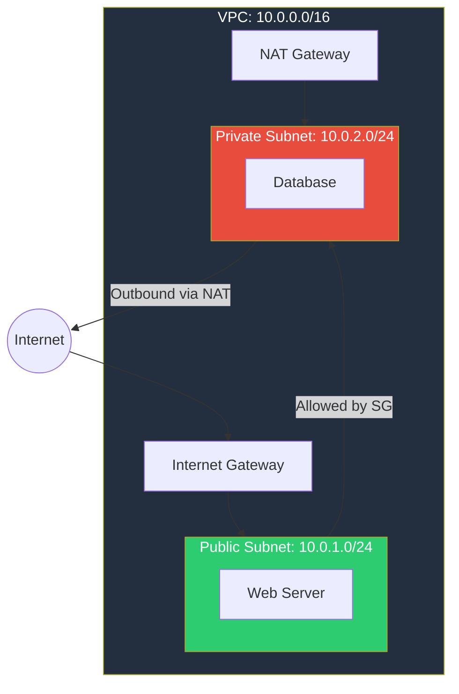

# Section 4: VPC & Networking

## VPC Overview

A Virtual Private Cloud (VPC) is your own isolated network within AWS. By default, nothing can communicate in or out unless you explicitly allow it.



## Key Components

**Subnets:** Segment of VPC address space. Each subnet lives in one AZ. **Public subnet** = has a route to an internet gateway. **Private subnet** = no direct internet access.

**Internet Gateway (IGW):** Allows resources in public subnets to communicate with the internet. One per VPC.

**NAT Gateway:** Allows resources in private subnets to reach the internet (for updates, patches) while preventing inbound connections from the internet. Managed service, lives in a public subnet.

**Route Tables:** Rules that determine where network traffic is directed. Each subnet is associated with one route table.

## Security Layers

**Security Groups (SGs):** Stateful firewall at the instance level. Allow rules only — no deny rules. If traffic is allowed in, the return traffic is automatically allowed. Default: deny all inbound, allow all outbound.

**Network ACLs (NACLs):** Stateless firewall at the subnet level. Both allow and deny rules. Rules evaluated by number (lowest first). Default: allow all. Must explicitly allow return traffic.

| Feature | Security Groups | NACLs |
|---------|----------------|-------|
| Level | Instance | Subnet |
| Stateful | Yes | No |
| Rules | Allow only | Allow + Deny |
| Default | Deny all inbound | Allow all |

## CLI Examples

```bash
# Create a VPC
aws ec2 create-vpc --cidr-block 10.0.0.0/16 \
  --tag-specifications 'ResourceType=vpc,Tags=[{Key=Name,Value=ProdVPC}]'

# Create subnets
aws ec2 create-subnet --vpc-id vpc-123 --cidr-block 10.0.1.0/24 \
  --availability-zone eu-north-1a --tag-specifications 'ResourceType=subnet,Tags=[{Key=Name,Value=PublicWeb}]'

# Describe security groups
aws ec2 describe-security-groups --filters "Name=vpc-id,Values=vpc-123" --output table
```

## VPC Connectivity

**VPC Peering:** Direct connection between two VPCs (even cross-account, cross-region). No transitive routing — A-B and B-C does not mean A-C.

**Transit Gateway:** Hub-and-spoke model connecting multiple VPCs. Solves the transitive routing problem.

**VPN Gateway:** Encrypted tunnel over public internet to on-premises.

**Direct Connect:** Dedicated private connection to AWS, not over internet (like Azure ExpressRoute).

**VPC Endpoints:** Access AWS services (S3, DynamoDB) without going through the internet. Gateway endpoint (free, for S3/DynamoDB) or Interface endpoint (uses PrivateLink, costs money).

---

[⬅️ Back to AWS SAA-C03 Index](../)
