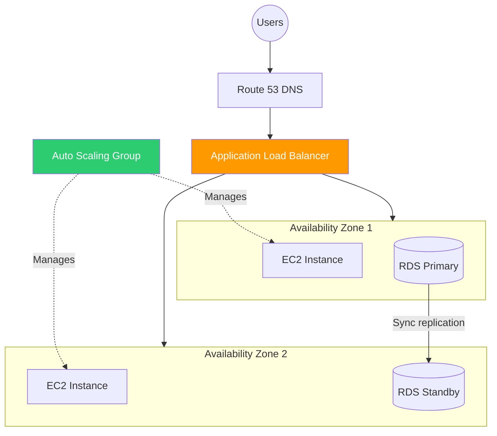

# Section 7: High Availability & Scaling

## Architecture Pattern

## Elastic Load Balancing (ELB)

**Application Load Balancer (ALB):** Layer 7 (HTTP/HTTPS). Content-based routing (path, host, headers). Best for web applications and microservices.

**Network Load Balancer (NLB):** Layer 4 (TCP/UDP). Ultra-low latency, millions of requests per second. Best for gaming, IoT, real-time applications.

**Gateway Load Balancer (GWLB):** Layer 3. Routes traffic through third-party virtual appliances (firewalls, IDS/IPS).

## Auto Scaling Groups (ASG)

Automatically adjust the number of EC2 instances based on demand. Define: minimum (always running), desired (target), maximum (upper limit).

**Scaling policies:** Target tracking (keep CPU at 50%), step scaling (add 2 instances when CPU > 70%), scheduled (scale up every Monday 8 AM).

**Health checks:** EC2 status checks and/or ELB health checks. Unhealthy instances are terminated and replaced.

## Route 53

AWS DNS service. Supports routing policies: simple, weighted (split traffic), latency-based (closest region), failover (active-passive), geolocation (by user country), multi-value.

## Design for Failure

Everything fails, all the time. Assume any single component can fail. Design so the system continues working when individual components fail. Multi-AZ, multi-region, automated recovery, loose coupling between components.

---

[⬅️ Back to AWS SAA-C03 Index](../)
