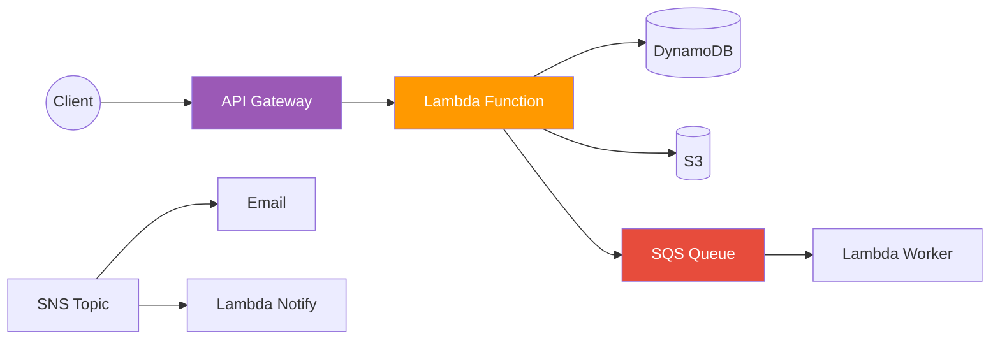

# Section 9: Serverless

## Serverless Architecture Pattern

## AWS Lambda

Run code without managing servers. Supports: Python, Node.js, Java, Go, .NET, Ruby, custom runtimes. Max 15 minutes execution. Max 10 GB memory. Pay per invocation and execution duration.

**Triggers:** API Gateway, S3 events, SQS messages, DynamoDB Streams, CloudWatch Events/EventBridge, SNS, IoT, and many more.

**Best practices:** Keep functions small and focused. Use environment variables for configuration. Avoid long-running processes (use Step Functions instead). Use layers for shared dependencies.

## API Gateway

Fully managed API front door. Handles: rate limiting, authentication, caching, request/response transformation, CORS, API versioning. REST API or HTTP API (simpler, cheaper) or WebSocket API (real-time).

## Messaging Services

**SQS (Simple Queue Service):** Decouple components. Standard queue (at-least-once, best-effort ordering) or FIFO queue (exactly-once, guaranteed ordering). Dead-letter queue for failed messages.

**SNS (Simple Notification Service):** Pub/sub messaging. One message published to a topic is delivered to all subscribers. Subscribers: Lambda, SQS, HTTP, email, SMS.

**EventBridge:** Event bus for event-driven architectures. Rules match events and route to targets. Supports custom events and third-party SaaS events.

## Step Functions

Orchestrate multiple Lambda functions into workflows. Visual workflow designer. Handle branching, retries, error handling, parallel execution. State machine defined in JSON (Amazon States Language).

---

[⬅️ Back to AWS SAA-C03 Index](../)
