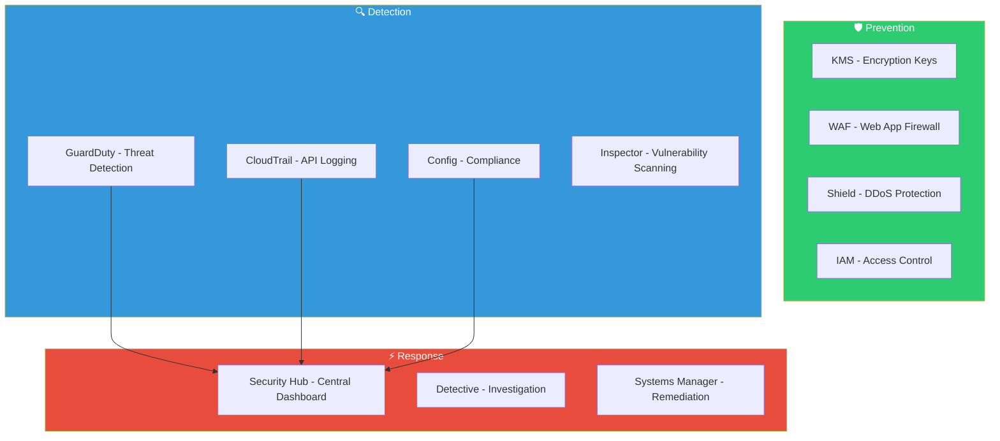

# Section 10: AWS Security

## Security Services Overview



## Key Services

**KMS (Key Management Service):** Create and manage encryption keys. Integrates with S3, EBS, RDS, Lambda, and most AWS services. Customer-managed keys (CMKs) for full control over rotation, policies, and audit. Key policies define who can use and manage keys.

**CloudTrail:** Logs every API call made in your AWS account. Who did what, when, from where. Essential for auditing and forensics. Enabled by default (90-day event history). Create a trail to store logs permanently in S3.

**GuardDuty:** Threat detection service. Analyzes CloudTrail, VPC Flow Logs, and DNS logs using ML. Detects: cryptocurrency mining, credential compromise, unauthorized access, data exfiltration, malicious IP communication. Findings ranked by severity.

**AWS Config:** Track resource configurations over time. Evaluate compliance against rules. Detect configuration drift. Remediate non-compliant resources automatically.

**Security Hub:** Central dashboard aggregating findings from GuardDuty, Inspector, Config, Macie, Firewall Manager. Compliance checks against CIS benchmarks and AWS best practices.

**WAF (Web Application Firewall):** Protect web apps from common exploits. Rate limiting, IP blocking, SQL injection prevention, XSS prevention. Works with ALB, API Gateway, CloudFront.

**Shield:** DDoS protection. Standard tier is free and always on. Advanced tier adds 24/7 DDoS response team, cost protection, and enhanced detection.

## CLI Examples

```bash
# Check GuardDuty findings
aws guardduty list-findings --detector-id <id> \
  --finding-criteria '{"Criterion":{"severity":{"Gte":7}}}'

# Search CloudTrail for recent API calls
aws cloudtrail lookup-events \
  --lookup-attributes AttributeKey=EventName,AttributeValue=DeleteBucket \
  --max-results 10

# List KMS keys
aws kms list-keys --output table

# Describe a security finding in Security Hub
aws securityhub get-findings \
  --filters '{"SeverityLabel":[{"Value":"CRITICAL","Comparison":"EQUALS"}]}'
```

## Real-World: AWS Community GameDay Europe 2026

24-hour competitive cloud security exercise ("Security Chaos" quest). Hands-on experience with:

**Task 1 — Crypto miner detection:** Identified cryptocurrency mining on EC2 via GuardDuty finding `CryptoCurrency:EC2/BitcoinTool.B!DNS`. Isolated the instance and confirmed mining process.

**Task 2 — RDP brute force:** Quarantined a compromised Windows instance with open RDP (3389). Replaced RDP access with AWS Systems Manager Session Manager — no inbound ports required.

**Task 3 — DNS exfiltration:** Discovered C2 communication via GuardDuty finding for DNS queries to `guarddutyc2activityb.com`. Analyzed VPC Flow Logs and Route 53 Resolver Query Logging to trace the compromised instance.

**Key services used:** GuardDuty, VPC Flow Logs, CloudTrail, Systems Manager, Route 53, Athena.

> [!NOTE]
> Full GameDay write-up available in [aws-gameday-2026/](../../../aws-gameday-2026/) in this repository.

---

[⬅️ Back to AWS SAA-C03 Index](../)
