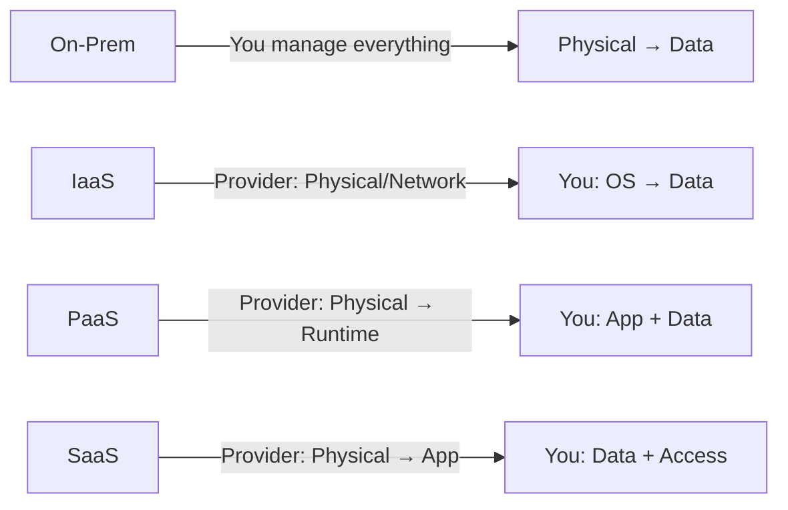

# Section 2: Cloud Computing Concepts

## What Is Cloud Computing

Cloud computing is the delivery of computing services (compute, storage, networking, databases) over the internet from large datacenters worldwide. Instead of owning and operating your own hardware, you rent resources from a cloud provider like Microsoft Azure, AWS, or Google Cloud.

You pay for what you use, when you use it — like electricity or water.

## Shared Responsibility Model

The most important concept on the exam. Security responsibility is split between the cloud provider and the customer, and the split changes depending on the service type.

**On-premises:** You are responsible for everything — physical security, power, cooling, networking, servers, OS, patching, applications, data, identities.

| Responsibility | On-Prem | IaaS | PaaS | SaaS |
|---------------|---------|------|------|------|
| Physical datacenter | You | Azure | Azure | Azure |
| OS and patching | You | You | Azure | Azure |
| Network controls | You | You | Shared | Azure |
| Applications | You | You | You | Azure |
| Data and access | You | You | You | You |

**Key rule:** You are ALWAYS responsible for your data, accounts, and devices regardless of cloud model.

## Cloud Deployment Models

**Public cloud:** Owned by third-party provider. Multi-tenant. Available over internet. No CapEx, only OpEx. Fast provisioning.

**Private cloud:** Dedicated to one organization. Can be on-prem or hosted. Full control over security. Higher cost (CapEx).

**Hybrid cloud:** Combination of public and private. Most flexible model. Keep sensitive data on-prem, burst to cloud for scale.

**Exam trap:** "Most flexibility?" = Hybrid. "Lowest cost?" = Public. "Most control?" = Private.

## CapEx vs OpEx

**CapEx (Capital Expenditure):** Upfront investment in physical infrastructure. Depreciated over time. Traditional model.

**OpEx (Operational Expenditure):** Pay-as-you-go. No upfront cost. Cloud model.

## Serverless Computing

Serverless does NOT mean no servers — it means you never manage them. The provider handles all infrastructure. You only write and run code.

In Azure: **Azure Functions** is the primary serverless offering. Event-driven, automatic scaling, micro-billing (pay per execution down to milliseconds). No execution = no cost.

---

## Shared Responsibility Diagram

## Real-World Example: Why This Matters

**Thales Data Threat Report 2022:** 39% of critical infrastructure organizations were breached in the past 12 months, often because they did not properly address their side of the shared responsibility model. Only 28% could fully classify their data. The shared responsibility model is not just exam theory — it is the reason breaches happen.
-e 
---
[⬅️ Back to AZ-900 Index](../)
