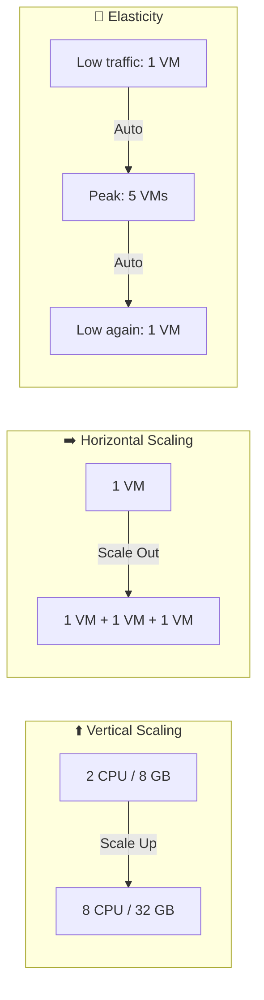

# Section 3: Benefits of Cloud Computing

## High Availability (HA)

The ability of a system to remain operational during planned or unplanned outages.

SLA guarantees: 99% = ~1.68h downtime/week | 99.9% = ~10 min | 99.95% = ~5 min | 99.99% = ~1 min. Higher SLA = higher cost.

**Planned outages:** OS security patches, application updates, hardware replacement, provider migration. Mitigate with: gradual deployment strategy (1-10-100), testing and monitoring, easy rollback plan, small frequent deployments, DevOps automation pipelines.

**Unplanned outages:** Hardware failure, network disruptions, power outages, natural disasters, cyber attacks, software bugs. Mitigate with: redundancy in every core component, availability sets and zones, cross-region load balancing (Azure Front Door), constant health monitoring and probes, automation for failover, geographic distribution, disaster recovery plan (test it with fire drills and load testing).

## Scalability

The ability of a system to handle increased demand by adding or removing resources.

**Vertical scaling (scale up/down):** Add more CPU/RAM to a single machine. Limited by max machine capacity.

**Horizontal scaling (scale out/in):** Add more machines. Theoretically unlimited.

Impact on cost: more resources = more cost. Reducing resources = reduced cost. A scalable system lets you be perfectly sized for the demand.

## Elasticity

Automatic scaling — the system adjusts resources automatically based on demand without manual intervention. Often called autoscaling. Monitors metrics like CPU utilization, adds resources when busy, removes when idle.

**Difference from scalability:** Scalability is the ability to scale. Elasticity is that it happens automatically.

Benefits: efficient resource use, minimize computing waste, higher max capacity than static provisioning could afford.

## Reliability

The ability of a system to recover from failure. Azure's global infrastructure with regions worldwide enables multi-region deployment. How it is achieved: auto-scaling, avoid single points of failure, multi-region deployment, data backup and replication, health probes and self-healing.

## Predictability

The ability to forecast and control performance and costs. Achieved through: autoscaling, load balancing, different instance types and pricing tiers, cost management tools (budgets, spending APIs).

## Security and Governance

Cloud providers invest heavily in platform security, go through security audits and compliance certifications, and provide tools for customers to enable and monitor security. Key Azure tools: Azure Policy, RBAC, Entra ID, always-on DDoS, TLS, encryption by default at rest and in transit, firewalls, update management.

## Manageability

**Management of the cloud:** Autoscaling, template-based deployment, monitoring and alerting, self-healing.

**Management in the cloud:** Azure Portal (web), CLI, PowerShell, Cloud Shell, REST APIs.

---

## Scaling Diagram

## Real-World Example

**Maersk NotPetya (2017):** $300M in damages because their systems had no geographic distribution or cloud-based disaster recovery. Azure's built-in HA features (availability zones, region pairs, geo-redundant storage) exist specifically to prevent this kind of total infrastructure loss.
-e 
---
[⬅️ Back to AZ-900 Index](../)
