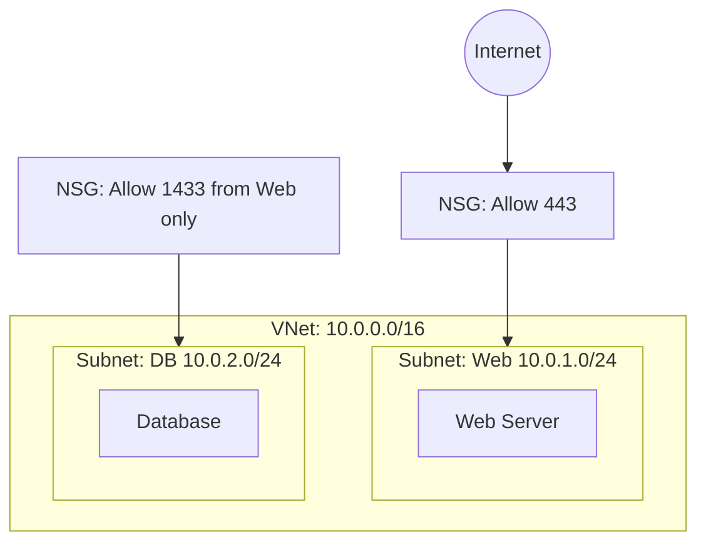

# Section 6: Azure Compute and Networking Services

## Compute Services

**Virtual Machines:** IaaS. A slice of a physical machine shared with other customers. Full control over OS. All VMs MUST belong to a virtual network. Linux more popular than Windows in Azure. Over 700 VM types to choose from (CPU cores, speed, RAM, disk, IOPS). Scale up (bigger VM) or scale out (more VMs).

> **Analogy:** A physical host is like an apartment building. A VM is an apartment. You share common services (power, cooling, networking) provided by the landlord (Azure). Inside the apartment, it feels like a house.

**VM Scale Sets:** Group of identical VMs that grow and shrink based on monitoring demand, time schedule, or other factors. Includes load balancer and autoscaling.

**Availability Sets:** Separate identical VMs for fault isolation. Fault domains (separate power/network switches) and update domains (separate maintenance windows).

**App Service (Web Apps):** PaaS. Upload code and config, Azure runs it. No access to underlying hardware. Includes scaling, CI/CD, containers, staging environments.

**Containers:** Everything the app needs in a container image. Faster and easier to deploy than VMs. Azure Container Instances (ACI) for single instances. Azure Container Apps for easy use with advanced features. Azure Kubernetes Service (AKS) for enterprise-grade cluster management.

**Azure Virtual Desktop:** Desktop version of Windows running in the cloud. Available from any device or browser.

**Azure Functions:** Small pieces of code running entirely in the cloud. Triggered by events (HTTP call, timer, blob creation, message queue). Very inexpensive. Supports durable and long-running functions.

## Networking Services

By default, two VMs in Azure cannot talk to each other — security by design.

**Virtual Networks (VNets):** Assigned IPv4 or IPv6 address space. Private addresses not accessible from outside. Subdivided into subnets, each with a range from the parent VNet address space. Security layer between subnets controls traffic flow.

**Network Security Groups (NSGs):** ACL rules with source, port, destination, port, protocol. Wildcards supported. Rules have priority numbers. Allow or deny traffic between subnets.

**VNet Peering:** Connects two separate VNets so VMs can communicate across them. Traffic stays on Microsoft backbone.

**Azure DNS:** Map IP addresses to domain names.

**VPN Gateway:** Encrypted tunnels over public internet. Site-to-site (office to Azure) and point-to-site (home to Azure). Requires hardware VPN device on-prem.

**ExpressRoute:** Private dedicated connection, not over internet. Most secure option.

**Endpoints:** Public (internet access), public with specified networks, private endpoint (private network interface, most secure and most difficult to set up).

---

## Network Architecture Diagram



## CLI Examples

```bash
# Create a Linux VM
az vm create --resource-group myRG --name myVM \
  --image Ubuntu2204 --admin-username azureuser \
  --generate-ssh-keys --size Standard_DS2_v2

# List running VMs (cost monitoring)
az vm list -d --query "[?powerState=='VM running']" -o table

# Create a VNet with subnet
az network vnet create --resource-group myRG --name myVNet \
  --address-prefix 10.0.0.0/16 --subnet-name WebSubnet \
  --subnet-prefix 10.0.1.0/24

# Create NSG rule allowing HTTPS
az network nsg create --resource-group myRG --name WebNSG
az network nsg rule create --resource-group myRG --nsg-name WebNSG \
  --name AllowHTTPS --priority 100 --destination-port-ranges 443 \
  --access Allow --protocol Tcp
```

## Real-World Examples

**Maersk:** Runs 500 SAP servers on Azure VMs with ExpressRoute for private connectivity. Classic IaaS lift-and-shift of mission-critical workloads.

**Colonial Pipeline (2021):** Breached through a single VPN credential without MFA. In Azure, VPN Gateway combined with Conditional Access requiring MFA and compliant devices prevents this attack vector.
-e 
---
[⬅️ Back to AZ-900 Index](../)
