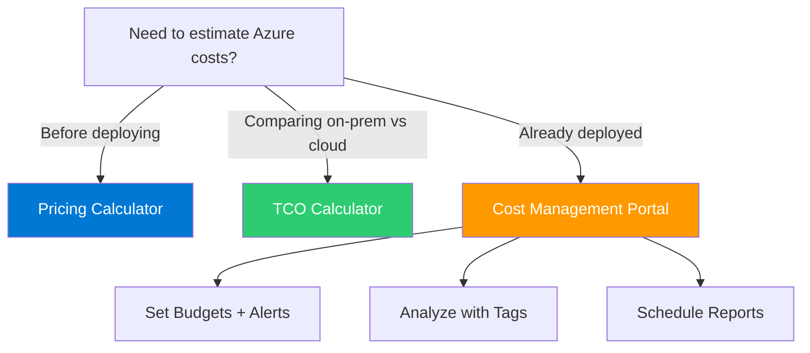

# Section 9: Cost Management in Azure

## Top Factors Affecting Cost

1. **Resource type:** Different services have different pricing structures
2. **Usage and billing model:** Pay-as-you-go, reserved instances, spot pricing
3. **Service tier and configuration:** SKUs and tiers — more CPU/memory increases cost
4. **Region:** Prices vary between regions (Brazil is more expensive than US East)
5. **License costs:** Some services include licensing, others don't — Azure Hybrid Benefit reuses Windows/SQL licenses
6. **Data transfer:** Inbound data is free, outbound data costs money, inter-region transfers cost
7. **Idle resources:** Running VMs doing nothing still cost money. Reserved IPs and orphaned disks generate charges.

## Pricing Tools

**Pricing Calculator:** Estimate cost of individual Azure services before deploying. Add services like a shopping cart, configure region/size/OS/uptime, see estimated monthly cost. Can compare regions and instance types. Savings plans (1-3 year commitment) cut costs dramatically.

**TCO Calculator:** Compare on-premises vs Azure costs. Define current on-prem servers, databases, storage, networking. Shows savings over 1-5 years.

**Key difference:** Pricing Calculator = "what will it cost in Azure?" TCO Calculator = "how much do I save by migrating?"

## Cost Management in Azure Portal

Free tool to analyze spending over time (superpower for understanding trends), forecast future costs, track against budgets, view past invoices, schedule reports.

## Resource Tags

Key-value metadata pairs attached to resources for organization. Used for cost tracking (department, project, owner), automation, and governance. Tags are NOT inherited unless enforced by Azure Policy. Can also audit missing tags.

## Resource Locks

Prevent accidental modification or deletion:
- **Delete lock (CanNotDelete):** Can read and modify, cannot delete
- **ReadOnly lock:** Can only read, no modifications or deletion

Applied at resource, resource group, or subscription level. Even Owner role is stopped by locks — must remove the lock first. Can restrict who can unlock using RBAC. Locks are a weak form of security (preventing accidents, not attacks).

---

## Cost Decision Diagram



## CLI Examples

```bash
# Tag a resource group for cost tracking
az group update --name ProductionRG --tags Department=Security Project=SOC

# Apply a delete lock to prevent accidental deletion
az lock create --name CriticalLock --resource-group ProductionRG \
  --lock-type CanNotDelete

# List all locks on a resource group
az lock list --resource-group ProductionRG -o table
```

> [!TIP]
> Pricing Calculator = "what will it cost in Azure?" · TCO Calculator = "how much do I save by migrating?"
-e 
---
[⬅️ Back to AZ-900 Index](../)
