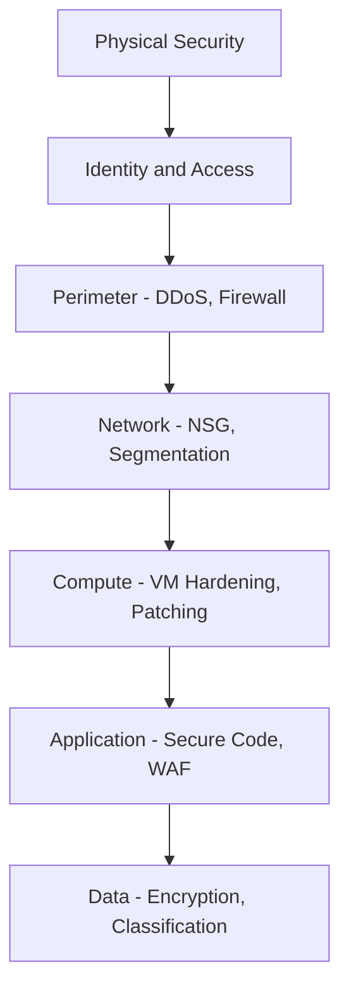

# Section 10: Identity, Access and Security

## Identity in Computing

An identity is a representation of a person, application, or device. Examples: a user name, an email, a time-entry application, a printer on floor 6. Usually requires a password, secret key, or certificate to prove.

## Before Cloud: Client-Server Model

Client app sends credentials to server, server checks against database with hashed passwords. Many famous hacks targeted custom identity systems: plain text storage, outdated hashing (MD5), storing salt with data, not enforcing password complexity or rotation.

## Microsoft Entra ID (formerly Azure AD)

Cloud-first identity provider. NOT a direct replacement for on-prem Active Directory. AD uses Kerberos and LDAP. Entra ID uses OAuth and SAML with JSON tokens and single sign-on. Legacy apps not compatible with Entra ID need Entra Domain Services.

**Benefits:** Microsoft is a world leader in identity security. Reduces development time (use APIs instead of coding your own auth). AI-powered threat logging detects unusual patterns. Centralized administration. SSO across applications. Integrates with all Azure services.

## Authentication vs Authorization

**Authentication:** Proving who you are (username + password). **Authorization:** Ensuring you are permitted to perform an action. Move away from all authenticated users having admin access.

## External Identities

**B2B (Business-to-Business):** Invite external partners as guest users. They use their own credentials. You assign roles and permissions same as internal users.

**B2C (Business-to-Consumer):** Customers sign in to your application using social identities (Facebook, Google). They do not appear in your organization directory.

## Single Sign-On (SSO)

One identity gets you access to many resources. App is registered with Entra ID, the app trusts Entra ID, Entra issues an encrypted token that can only be decrypted by the private key. Token is trusted by all registered apps. Fewer logins, stronger MFA is less tiresome.

## Conditional Access

Not all login attempts are equally safe. Evaluates signals to make access decisions:

**Signals:** User identity, location, device, application, real-time risk level
**Decisions:** Allow access, require MFA, block access

## Multi-Factor Authentication (MFA)

Requires 2+ pieces of evidence: something you **know** (password), something you **have** (phone, authenticator app), something you **are** (fingerprint, face scan). SIM cards can be spoofed — authenticator apps are more secure. Admin accounts can use MFA for free in Entra ID.

## Passwordless Authentication

Replaces passwords with something you have + something you are. Methods: Windows Hello (gesture/biometric), Microsoft Authenticator, FIDO2 security keys. More secure and more convenient than passwords.

## RBAC (Role-Based Access Control)

Microsoft's preferred solution. Create roles for your organization (developer, operations, IT, security). Assign users to roles. Avoid exceptions where individual users have unexpected admin privileges. Three basic roles: Reader, Contributor, Owner.

## Zero Trust Model

Old model: everything inside the corporate network was assumed safe. Zero trust: trust nobody, verify everyone.

**Principles:** Verify explicitly (use every available method to validate identity). Use least privileged access (JIT, JEA). Assume breach (secure each identity, encrypt all communication, monitor everything).

## Defense in Depth

Security in layers: Physical > Identity > Perimeter > Network > Compute > Application > Data

## Microsoft Defender for Cloud

Security posture management: regulatory compliance, threat detection, workload protections, firewall manager, DevOps security. Secure Score shows your security posture.

---

## Defense in Depth Diagram



## CLI Examples

```bash
# List Azure AD users
az ad user list --query "[?accountEnabled]" -o table

# Assign Reader role to a user
az role assignment create --assignee user@example.com \
  --role "Reader" --resource-group myRG

# Check Defender for Cloud secure score
az security secure-score-controls list -o table
```

## Real-World Examples

**Colonial Pipeline (May 2021):** DarkSide ransomware group accessed Colonial Pipeline through a single compromised VPN password — an unused account that lacked MFA. They stole 100GB of data in two hours, encrypted critical systems, shut down 5,500 miles of pipeline (45% of US East Coast fuel supply), and caused fuel shortages across 17 states. Ransom paid: $4.4M in Bitcoin. Root cause: one credential without MFA. This is exactly what Conditional Access policies prevent.

**Maersk NotPetya (2017):** NotPetya wiped 45,000 PCs, 4,000 servers, and all 150 domain controllers. Cost: $300M. But Maersk had deployed Azure AD SSO with Password Hash Sync weeks before. With on-prem AD destroyed, employees could still sign into cloud apps through Azure AD. This is why cloud identity (Entra ID) matters — it survives when on-prem dies.

**Thales 2022:** Only 51% of critical infrastructure organizations had MFA deployed. Only 30% had a formal Zero Trust strategy. Those with Zero Trust were less likely to have been breached.
-e 
---
[⬅️ Back to AZ-900 Index](../)
