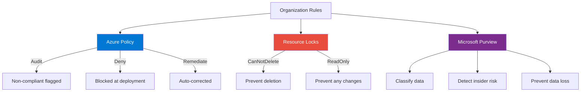

# Section 11: Azure Governance and Compliance

## What Is Governance

The leaders, processes, and rules that guide how an organization operates. Can be formal groups like an IT security committee or architecture review board. Rules get checked so the organization doesn't get hacked.

**Example rules:** All servers must run software within Microsoft extended support guidelines. All servers backed up every 24 hours minimum. Firewalls must block all inbound ports except 443. Only operations can reboot a production server.

## Azure Governance Tools

**Azure Policy:** Evaluate compliance of rules. Predefined policies from Azure (100+) or build your own in JSON. Examples: require SQL Server 12.0, allowed storage account SKUs, allowed deployment locations, allowed VM SKUs, automatically apply tagging, not allowed resource types.

Assign policies at subscription, resource group, or resource level. Non-compliant resources get flagged. Validation failed errors show policy enforcement in action. Used for cost control and resource standardization.

**Policy Initiatives:** Group of related policies. Example: PCI DSS compliance initiative contains all policies needed for PCI requirements.

**Resource Locks:** Restrict modification or deletion. Delete lock (can modify, cannot delete) or ReadOnly lock (read only). Applied at resource, resource group, or subscription level. Even Owner role stopped by locks. Use RBAC to restrict who can unlock. Locks are a weak form of security — preventing accidents, not attacks.

**Microsoft Purview:** Unified data governance platform. Auditing, communication compliance, data map and catalog, eDiscovery, information protection, insider risk management, data loss prevention (DLP), compliance manager.

Key capabilities: know your data (what sensitive information is stored where), protect your data (sensitivity labels, encryption), prevent data loss (browser extensions, pop-up tips, block sharing), govern your data lifecycle. Powered by intelligent platform that identifies potential malicious or inadvertent insider activity: IP theft, data leakage, security violations, data theft by departing employees, risky browser usage, malware installation.

---

## Governance Flow Diagram



## CLI Examples

```bash
# List all policy assignments
az policy assignment list -o table

# Create a policy assignment to require tags
az policy assignment create --name "require-env-tag" \
  --policy "/providers/Microsoft.Authorization/policyDefinitions/require-tag" \
  --scope "/subscriptions/<sub-id>"

# Apply a ReadOnly lock
az lock create --name ProductionFreeze --resource-group ProdRG \
  --lock-type ReadOnly
```

## Policy Example (JSON)

```json
{
  "if": {
    "field": "location",
    "notIn": ["norwayeast", "norwaywest", "westeurope"]
  },
  "then": {
    "effect": "deny"
  }
}
```

> [!IMPORTANT]
> Azure Policy controls **what resources can do**. RBAC controls **what users can do**. Don't confuse them on the exam.
-e 
---
[⬅️ Back to AZ-900 Index](../)
