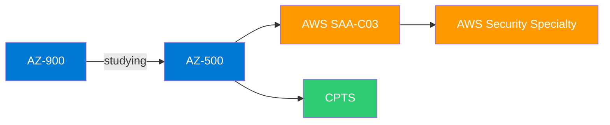

# 🔐 Cybersecurity & Cloud Study Notes

Personal study notes for Azure certifications, built while studying cybersecurity at Høyskolen Kristiania, Oslo. Each set of notes integrates multiple sources: certification material, industry frameworks, real-world threat data, and practical tooling.

## 📚 Study Notes

| Certification | Sources | Notes |
|:-------------|:--------|:-----:|
| **AZ-900: Azure Fundamentals** | Scott Duffy (Udemy), Microsoft Learn, DevOps for Dummies, Classic Shell Scripting, Thales 2022 Report | [📖 Study Notes](az-900-azure-fundamentals/) |
| **AZ-500: Azure Security Technologies** | Okeyode (Packt, 526p), CSA Security Guidance v4.0 (152p), Thales 2022, Microsoft Learn | [📖 Study Notes](az-500-azure-security/) |

## 🔗 Why Multiple Sources Per Certification

> [!NOTE]
> Certification exams test knowledge in isolation. Real security work requires connecting concepts across domains.

**AZ-900** integrates DevOps pipeline concepts, shell scripting examples (how you actually manage Azure from the terminal), and Thales breach data (why shared responsibility and MFA gaps matter in practice).

**AZ-500** integrates the CSA Security Guidance framework (vendor-neutral principles behind everything Microsoft-specific) and Thales threat landscape data (real-world context for every control you configure).

## 🗺️ Certifications Roadmap

## 🛠️ Hands-On Practice

| Platform | Focus | Details |
|----------|-------|---------|
| 🏆 TryHackMe | Offensive & Defensive | Top 2% globally ([Fredthenew](https://tryhackme.com/p/Fredthenew)) |
| 🎯 Hack The Box | Penetration Testing | Active challenges |
| 🎓 Bachelor Thesis | AI Security | LLM backdoor attack detection on HPC GPU cluster |
| ☁️ AWS GameDay 2026 | Cloud IR | GuardDuty, VPC Flow Logs, incident response |
| 🤝 CYBSEC Org | Industry Events | mnemonic, Palo Alto Networks, Bouvet |

---

BSc Cybersecurity, Høyskolen Kristiania (graduating summer 2026) · Student Assistant (Python & C for Linux) · CYBSEC Business & Events Coordinator

[GitHub](https://github.com/Aleks1712) · [TryHackMe: Top 2%](https://tryhackme.com/p/Fredthenew)
