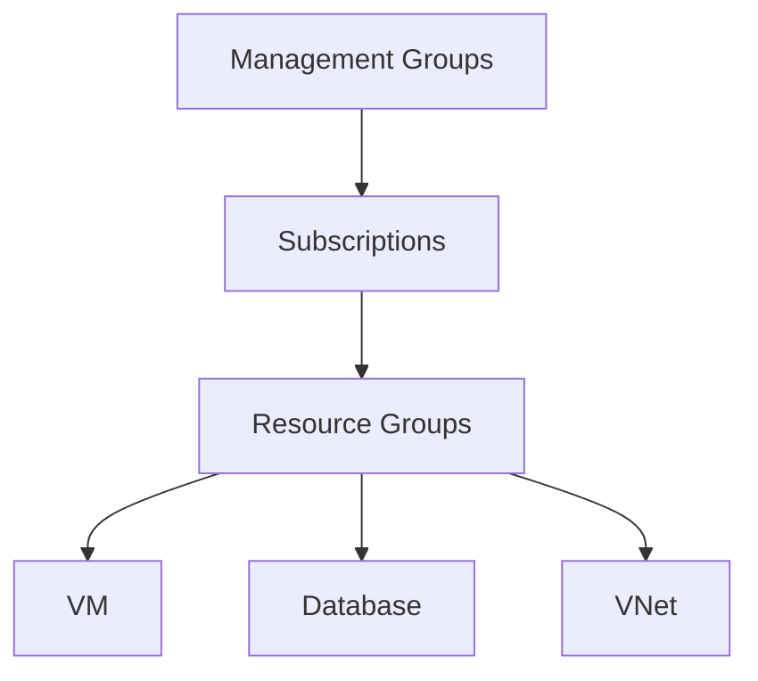

# Section 5: Core Architectural Components of Azure

## Physical Infrastructure

**Regions:** Geographic areas containing one or more datacenters connected by low-latency networking. 60+ regions worldwide. Choice affects: latency to users, service availability, pricing, data residency (GDPR).

**Region pairs:** Most regions paired with another 300+ miles away. Benefits: automatic replication for some services, sequential updates, priority recovery during outages. Example: Norway East paired with Norway West.

**Sovereign regions:** Isolated instances for compliance. Azure Government (US military/government), Azure China (operated by 21Vianet). Not connected to public Azure, require approval.

**Availability Zones:** Physically separate datacenters within a region. Independent power, cooling, networking. At least 3 per enabled region. Three service categories:
- **Zonal:** Resource pinned to specific zone (VM, managed disk)
- **Zone-redundant:** Auto-replicated across zones (zone-redundant storage, SQL Database)
- **Non-regional (always available):** Global services resilient to any outage (Azure Portal, Entra ID, Front Door)

## Logical Organization

**Resource hierarchy:**

```
Management Groups (max 6 levels deep)
  └── Subscriptions (billing + access boundary)
        └── Resource Groups (logical container)
              └── Resources (VMs, databases, VNets, etc.)
```

**Resources:** Basic building block. Everything in Azure is a resource. Created via Portal, CLI, PowerShell, or ARM templates. Most have a cost associated.

**Resource Groups:** Logical grouping. Each resource MUST belong to exactly one group. A group can hold resources from different regions. Deleting a group deletes ALL resources in it. No security boundary between resources in a group.

**Subscriptions:** Billing unit and admin boundary. Separate by environment (dev/test/prod), department, or billing. Some resources have per-subscription limits. Users can have access to multiple subscriptions with different roles via RBAC.

**Management Groups:** Container for managing policies and compliance across multiple subscriptions. Hierarchical, conditions inherited downward. Root management group at the top.

---

## Resource Hierarchy Diagram



## CLI Examples

```bash
# List all resource groups
az group list -o table

# List all resources in a group
az resource list --resource-group myRG -o table

# Show subscription details
az account show -o table
```

## Real-World Example

**Maersk NotPetya (2017):** All 150 domain controllers were synced with no offline backup. When NotPetya hit, every single one was wiped simultaneously. Azure availability zones and geo-redundant storage are designed to prevent exactly this — zone-redundant services replicate across physically separate datacenters, and GRS replicates to a paired region 300+ miles away.
